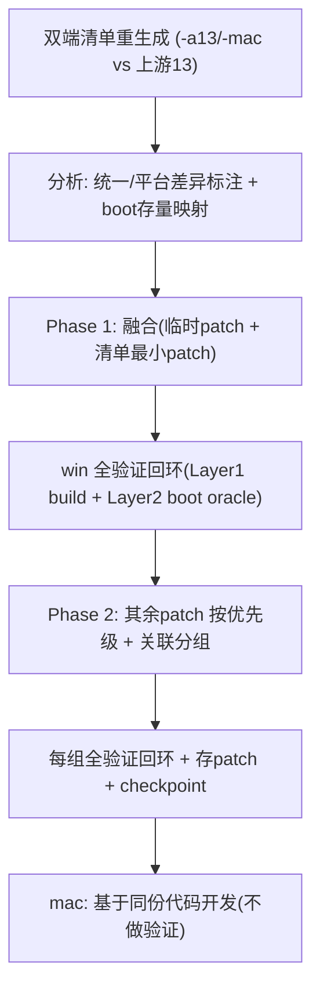

# .claude/ 设置路线图

本仓库 agent 工具如何随升级阶段演进。每项能力的触发是**项目阶段 gate**，不是日历日期——
gate 内容是 AOSP 升级里程碑。阶段开了、且有真东西可做时再加能力；提前搬来 = 维护闲置脚手架。

---

## 已完成里程碑（归档）

### M0 — 脚手架 + 环境 + android-13 win 基线
- [x] 脚手架（CLAUDE.md/rules/commands/skill/docs/registry）。
- [x] clouddev aosp16 sync（`android-16.0.0_r4`）。
- [x] win android-13 基线：`Root.vhd` 打包 → UUID 匹配 → BlueStacks 启动到 launcher（2026-06-25）。

### M1 — android-16 win boot（完成 · 2026-07-14）
- [x] 完整源码构建 `system.img`（lunch `android_x86_64-trunk_staging-eng`）。
- [x] boot 到 launcher：`sys.boot_completed=1` → host `Player state: ready` → Settings 可见 → 优雅关机。
- [x] 权威存档：[patches/android-16/RESTORE.md](../patches/android-16/RESTORE.md)（20 tracked patch + 92 untracked + bootimage/kernel）。
- [x] 问题全流程：[progress/android-16-boot-guide.md](../progress/android-16-boot-guide.md)。

> **注意**：M1 boot 跑在 `device/generic/common` + `device/generic/x86_64`，含大量 **临时 bringup hack**（permissive SELinux、check bypass、`r262` 关 shell transitions）。下一阶段要把临时 patch 与清单最小 patch **融合转正**，并迁移到统一板 `device/bst/qvirt`。

---

## 当前阶段：Phase 2 — guest 全量功能对齐（host/Phase3 暂不规划）

### Phase 1 — 融合最小 boot 集（**完成 · 2026-07-17 cont.4**）

目标：把「能 boot 的最小集」从临时形态**转正为结构化的最小 BST 定制集**，并迁移到统一板 `device/bst/qvirt`（x86_64/arm64 各自定制）。

- [x] 双端定制清单重生成（`-a13`/`-mac` vs 上游 android-13）→ registry v2（196 条；review-fix 2026-07-15）。
- [x] boot 存量映射进 registry（真定制 vs `temp_debt`）。
- [x] Phase 1 / Phase 2 计划成文（`progress/phase1-port-plan.md` / `phase2-port-plan.md`）。
- [x] **G1** 统一板 `device/bst/qvirt` / `bst_x86_64`：Layer1 ✅；Layer2 host oracle 全绿（boot 到 launcher 可见）→ [G1-RESTORE](../patches/android-16/checkpoints/G1-RESTORE.md) · [porting-log cont.4](../progress/porting-log.md)。
- [x] G2–G10 最小 boot 集已并入可 boot 镜像（部分 temp_debt 挂 Phase 2）。
- 规则：`.claude/rules/dual-platform-customization.md`、`patch-porting.md`、`platform-win-first-mac-reuse.md`、`instrumentation-and-tests.md`。

**Gate→P2**：✅ win G1 boot 到 launcher + 临时债登记完整（见 G1-RESTORE §8）。

### Phase 2 — 其余定制 + **全量功能对齐**（**当前 · 唯一活跃阶段**）

> **人类决策 2026-07-21**：Phase 2 **必须完成** a13→a16 功能对齐（含 frameworks 全量子系统）；**不规划** host / Phase 3 任务；构建机争用不作问题、不处理。移植一律遵守 `.claude/rules/patch-porting.md` 等规则。

- [x] **P0 temp_debt**：`service.cpp` DIAG — ✅ VINTF formal（allocator in framework；manager@1.2 in system_ext）。
- [x] P0：gralloc `PRODUCT_PROPERTY_OVERRIDES` bake ✅。
- [x] **权威打包**：`m droid` + `g1_build_libs` + OUT-fold stage + r228（**禁**仅 `systemimage` / mount system.img）。
- [x] registry win P2 机械子集：**ported** art/bionic/icu/boringssl/fw-base(BatchC+D+BstUtils)/fw-native；external noise dropped。Root **`d2e35648`** Layer2 **7/7 @252s**。
- [x] **mac**：`bst_arm64` + BoardConfig arch 分派（lunch `TARGET_ARCH=arm64`）；**不做独立验证**。
- [x] **SELinux**：对齐 a13 —— **强制 permissive**（`IsEnforcing→false` 等）；**禁止** port `enabled.c→0`（cont.21 实测炸 boot）。非「设计 enforcing sepolicy」专案。
- [x] **Shell Transitions / r262**：`android.hardware.power-service.example` + 恢复 `HintManagerService`（解开 R248 HALSkip）+ `ENABLE_SHELL_TRANSITIONS=true`；Root **`840137ca`** Layer2 **7/7**；本 boot 无 `aidl/performance_hint` missing（cont.22/22b）。
- [x] **P2-FRAMEWORK-REST**：**22/22 core/java** ✅；services/core gap 持续收口；**deferred 8/9 done**（D1/D2/D5/D6/D7/D8/D9 + ActiveServices；仅 D3 截图 defer 到虚拟化 port）；Root.vhd **`02690d11`** / system.img `a878d3c8` Layer2 **7/7 @161s**（cont.101）。frameworks/base source-vs-commit drift 清零（全 commit）。
- [x] P2-TEMP-FSTAB：obsolete（无 `/vdc` skip）。

**下一步**：① D3 截图共享（已 defer 到虚拟化 port 阶段，design 见 `progress/d3-redesign.md`）；② mac `bst_arm64` 同码收口；③ Phase 2 gate 收尾（a13 功能对齐）。详见 `phase2-port-plan.md` · `porting-log.md` cont.101。

**Gate（Phase 2 完成）**：a13 功能对齐通过（含 frameworks）；r262/`performance_hint` 已收口；SELinux permissive；mac 同码。**不设** host/Phase 3 gate。

### Phase 3 — host / CI（**暂不规划**）

> 人类决策：当前阶段**移除** host 端任务与排期。guest Phase 2 完成前不启 host 适配 / CI 专项。

---

## 跨阶段主线：自动 review→fix 循环

把 `implement → checkpoint → review → fix` 做成**可闭环**的循环，happy path 无人介入，人作异常处理器（非收敛/高严重度）。

- **已建**：`/review` 在新子代理跑 `quick-review`，机械发现自动修并重验，≤3 轮，升级其余。
- **Phase 1**：Layer 1 每组强制；Layer 2 boot 回归在「并入 boot 镜像」节点跑。
- **Phase 2+**：Layer 2 为每组 pass criterion；临时债（sepolicy/BLAST）属判断性 → escalate。

**自主边界（仅机械性）**：自动修 `#ifdef`/platform 宏/fstab 字段/clang-format/死 include/BoardConfig typo/init rc 语法/missing plan items；升级 dm-verity/SELinux/打包/binder-HAL/图形契约/虚拟化设备模型/host↔guest 契约/rebase 语义判断。编码于 `/review`。
