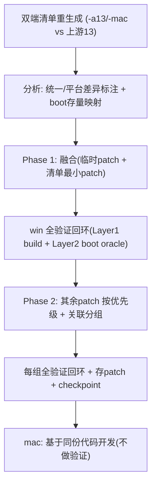

# .claude/ 设置路线图

本仓库 agent 工具如何随升级阶段演进。每项能力的触发是**项目阶段 gate**，不是日历日期——
gate 内容是 AOSP 升级里程碑。阶段开了、且有真东西可做时再加能力；提前搬来 = 维护闲置脚手架。

---

## 已完成里程碑（归档）

### M0 — 脚手架 + 环境 + android-13 win 基线
- [x] 脚手架（CLAUDE.md/rules/commands/skill/docs/registry）。
- [x] clouddev aosp16 sync（`android-16.0.0_r4`）。
- [x] win android-13 基线：`Root.vhd` 打包 → UUID 匹配 → BlueStacks 启动到 launcher（2026-06-25）。

### M1 — android-16 win boot（完成 · 2026-07-14）
- [x] 完整源码构建 `system.img`（lunch `android_x86_64-trunk_staging-eng`）。
- [x] boot 到 launcher：`sys.boot_completed=1` → host `Player state: ready` → Settings 可见 → 优雅关机。
- [x] 权威存档：[patches/android-16/RESTORE.md](../patches/android-16/RESTORE.md)（20 tracked patch + 92 untracked + bootimage/kernel）。
- [x] 问题全流程：[progress/android-16-boot-guide.md](../progress/android-16-boot-guide.md)。

> **注意**：M1 boot 跑在 `device/generic/common` + `device/generic/x86_64`，含大量 **临时 bringup hack**（permissive SELinux、check bypass、`r262` 关 shell transitions）。下一阶段要把临时 patch 与清单最小 patch **融合转正**，并迁移到统一板 `device/bst/qvirt`。

---

## 当前阶段：清单融合移植（Phase 1 → Phase 2）

### Phase 1 — 完成（G1 ported，2026-07-17 boot 到 launcher）

目标：把「能 boot 的最小集」从临时形态**转正为结构化的最小 BST 定制集**，并迁移到统一板 `device/bst/qvirt`（x86_64/arm64 各自定制）。

- [x] 双端定制清单重生成（`-a13`/`-mac` vs 上游 android-13）→ registry v2（196 条；review-fix 2026-07-15）。
- [x] boot 存量映射进 registry（真定制 vs `temp_debt`）。
- [x] Phase 1 / Phase 2 计划成文（`progress/phase1-port-plan.md` / `phase2-port-plan.md`）。
- [x] **G1** 统一板 `device/bst/qvirt` / `bst_x86_64`（脚手架 ✅；Layer1 ✅ `m droid` rc=0；Layer2 ✅ boot 到 launcher，host oracle 全绿，Root.vhd `2a7a497a`，porting-log cont.4）→ [G1 checkpoint](../patches/android-16/checkpoints/G1.md)。
- [ ] Phase 1 patch-group G2–G10 移植（见 [patches/registry.md](../patches/registry.md)）。
- [ ] 每组：文档（源/用途/质量/影响）→ Layer 1 →（并入 boot 镜像时）Layer 2 回归 → 存 patch → checkpoint。
- 规则：`.claude/rules/dual-platform-customization.md`、`patch-porting.md`、`platform-win-first-mac-reuse.md`、`instrumentation-and-tests.md`。

**Gate→P2**：win 上 G1–G10 融合完成 + Layer 2 boot 回归全绿 + 临时债登记完整；检查点可从 `RESTORE` 机制恢复。

**Phase 1 Gate ✅ 达成（2026-07-17）**：win G1 boot 到 launcher + host oracle 全绿 + 临时债登记完整；检查点可从 `G1-RESTORE.md` 恢复。**当前 = Phase 2**（temp_debt 收口 + G2-G10 余项有序移植）。

### Phase 2 — 其余定制 + 临时债收口

- [ ] registry 中非 P1 项按优先级 + 关联分组移植。
- [ ] 临时债真实修复：BST sepolicy、BLAST/SF commit callback（撤销 `r262`）、fstab/vold。
- [ ] 功能对齐 android-13 baseline。
- [ ] **mac**：基于同一份代码（统一源 + arm64 平台差异）开发；**不做独立验证**。

**Gate→P3**：功能对齐通过；临时债清零或显式 escalate；mac 代码就位。

### Phase 3 — host 适配收尾 / CI

- [ ] host 适配（hd/图形/虚拟化按需）。
- [ ] CI 化回归；deny 收紧；create-pr；复盘剪枝。

**Gate**：进入内部 dogfooding。

---

## 跨阶段主线：自动 review→fix 循环

把 `implement → checkpoint → review → fix` 做成**可闭环**的循环，happy path 无人介入，人作异常处理器（非收敛/高严重度）。

- **已建**：`/review` 在新子代理跑 `quick-review`，机械发现自动修并重验，≤3 轮，升级其余。
- **Phase 1**：Layer 1 每组强制；Layer 2 boot 回归在「并入 boot 镜像」节点跑。
- **Phase 2+**：Layer 2 为每组 pass criterion；临时债（sepolicy/BLAST）属判断性 → escalate。

**自主边界（仅机械性）**：自动修 `#ifdef`/platform 宏/fstab 字段/clang-format/死 include/BoardConfig typo/init rc 语法/missing plan items；升级 dm-verity/SELinux/打包/binder-HAL/图形契约/虚拟化设备模型/host↔guest 契约/rebase 语义判断。编码于 `/review`。
