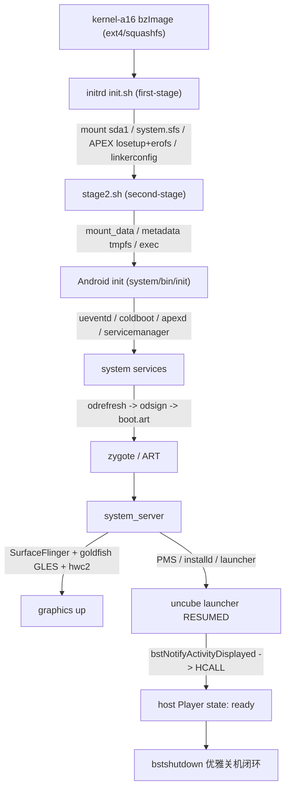

# Android-16 (Baklava) Boot 全流程参考

> BlueStacks 模拟器 guest 从 android-13 升级到 android-16（base `android-16.0.0_r4`）的**启动 bringup 全流程问题参考**。
> 目的：下一次做升级的 boot 阶段有完善的参考与指引。本文档只记录**具体问题**（症状 / 根因 / 解决方法 / 验证），按启动阶段组织，去除过程性叙事。
> 代码树修改的权威存档与一键恢复步骤见 [`patches/android-16/RESTORE.md`](../patches/android-16/RESTORE.md)。

---

## 0. 最终可运行状态（摘要）

boot 已跑通到**桌面可见 + 优雅关机**：

| 里程碑 | 证据 |
|---|---|
| 完整源码构建 `system.img` | `BUILD_EXIT=0`，1.99GB（首个可 boot 版本 md5 `f3228328307e3105d24276a711d806ac`） |
| zygote / odsign / boot.art 全链 | `odsign.key.done`、`odrefresh returned 80`、`Unable to open boot.art` = 0 |
| `sys.boot_completed=1` | guest ~178s（bootanim exit 0 @177s） |
| host `Player state: ready` | guest RESUMED → ActivityDisplayed HCALL → `fUiHideBootProgressBar`（HD overlay 撤掉切 GL） |
| Settings 可打开且可见 | Activity RESUMED + SF Settings layer visible / Output Layer；`Transition Root` = 0（**TEMP** R262+R262b 关 shell transitions） |
| 优雅关机 | 点 HD X → `bst.config.start_shutdown=1` → `bstshutdown_core` → `Exiting err: 0`，**无 20s 强制断电** |

**关键构建/产物身份**（恢复时对齐）：

| 项 | 值 |
|---|---|
| base manifest | `refs/tags/android-16.0.0_r4` |
| lunch target | `android_x86_64-trunk_staging-eng` |
| `OUT_DIR` | `out_nxt_Baklava64` |
| CLANG | `clang-r563880` |
| 构建 env | `ALLOW_MISSING_DEPENDENCIES=true`（**不要**设 `WITHOUT_CHECK_API` / `BUILD_FROM_SOURCE_STUB`） |
| kernel | kernel-a16 `bzImage`（ext4 + squashfs + BS 钩子，clang/LLVM=1） |
| guest 图形 | goldfish-opengl-pie（`patches/goldfish-opengl-pie-a16-fixes.patch`） |
| Root.vhd UUID | `54e9ad31-a169-4d5b-a0e0-705d62e96e71` |
| 最终验证态 Root.vhd md5（TEMP R262b） | `7a55ef636b0961c87bd0815cfc5c8cde`（含 Settings 可见；SystemUI.apk md5 `b1e647bc36ad53db430f705e21f14b7d`） |
| fastboot.vdi UUID | `91b80c95-...` |
| 部署目标 | `C:\ProgramData\BlueStacks_nxt\Engine\Tiramisu64\{Root.vhd,fastboot.vdi}` |
| host GPU | Intel Iris Xe（NVIDIA nvoglv64 在 SF Skia GL 路径崩溃，见阶段 9） |
| TEMP patch（boot 基线） | `patches/android-16/patches/aosp16__frameworks_base__r262-temp-disable-shell-transitions.patch`（BLAST/SF commit 修好后删除） |

**核心结论（战略）**：runtime-staging（通用 aosp_x86_64 预编译二进制 + 运行时替换）在 zygote `libandroid_runtime.so` C++ 静态构造阶段撞 ABI 墙，无法调和；最终走**完整源码构建 + BST device overlay** 才把 zygote / keystore2 / keymint 原生打通。见阶段 7「zygote Aborted」。

---

## 启动链总览



阶段编号与下文一一对应：0 构建配置 · 1 kernel · 2 打包 · 3 first-stage `init.sh` · 4 second-stage `stage2.sh` · 5 Android init 源码 · 6 APEX/linker · 7 zygote/ART · 8 system_server/services · 9 图形 · 10 host-guest HCALL · 11 launcher · 12 关机闭环。

---

## 阶段 0 构建配置

### 问题：build 参数不支持 `showcommands`
- 症状：首次编译 1 秒即退出，`BUILD_EXIT=2`，日志 `! The argument 'showcommands' is no longer supported` → `Invalid argument`。
- 根因：android-16 build 系统移除了 `showcommands`；A13 android target 用的 `make iso_img -j30 showcommands` 在 A16 失效。
- 解决方法：`Makefile` android target 加 `ifeq baklava` 分支，改用 `make iso_img -j$(numproc)`（去掉 showcommands）；verbose 输出改由 `out_nxt_Baklava64/verbose.log.gz` 提供。
- 验证：重启编译进入 make 阶段，不再 1 秒退出。

### 问题：A16 无 `iso_img` target
- 症状：`FAILED: ninja: unknown target 'iso_img'`（soong 自举后报未知 target）。
- 根因：A16 `trunk_staging` 是虚拟设备产品，不构建 android-x86 风格安装 ISO；A13 的 `iso_img` target 在 A16 不存在。
- 解决方法：baklava android target 改用 `make droid`（AOSP 顶层完整 target，产出 system/ staging + ramdisk.img + boot.img）+ `make ramdisk`。打包实际需要 `$(ANDROIDOUT)/system` 目录 + `ramdisk.img` + `root/`。
- 验证：`#### build completed successfully ####`，0 FAILED，~173,457 targets。

### 问题：A16 droid 产出目录名 `generic_x86_64`，Makefile 期望 `x86_64`
- 症状：`ANDROIDOUT .../product/x86_64` 为空，实际产物在 `.../product/generic_x86_64`。
- 根因：A13 lunch `android_x86_64-eng` → product 名 `x86_64`；A16 lunch 产品名为 `generic_x86_64`；Makefile 硬编码 `x86_64`。
- 解决方法：软连 `ln -s generic_x86_64 x86_64`（免改 Makefile，A13/A16 兼容）。
- 验证：ANDROIDOUT 指向真实产物目录，system/、root/、ramdisk.img 可见。

### 问题：`installer/` 目录缺失
- 症状：打包阶段 `cp: cannot stat installer`。
- 根因：A16 trunk_staging 不产 installer/（预期缺失）。
- 解决方法：Makefile `$(call copy,...)` 改为 `[ -d installer ] && copy || true` 容错。
- 验证：打包阶段跳过 installer 拷贝不再报错。

### 问题：`Module.symvers` 缺失
- 症状：打包阶段 `cp: cannot stat Module.symvers`。
- 根因：A16 GKI/独立 kernel 不产出 `obj/kernel/Module.symvers`。
- 解决方法：Makefile cp 加 `[ -f Module.symvers ]` 检查后再拷贝。
- 验证：拷贝步骤容错通过。

### 问题：`baklava.bluestacks.prop.us` 缺失
- 症状：`cp bluestacks.prop.us` 失败（文件名随 ANDROID_VERSION 变化）。
- 根因：BS prop 文件按版本命名，baklava 版本文件不存在。
- 解决方法：`cp tiramisu.bluestacks.prop.us baklava.bluestacks.prop.us`。
- 验证：prop 文件到位，打包继续。

### 问题：`adbd_rooted_baklava` 缺失
- 症状：打包引用 rooted adbd 二进制失败。
- 根因：baklava 版本文件不存在。
- 解决方法：从 tiramisu 版本复制（`cp adbd_rooted_tiramisu adbd_rooted_baklava`，MD5 相同）。
- 验证：文件到位。

### 问题：APKFOLDER 缺 25 apk（GMS + rosen）
- 症状：`copy_system_apks` 失败（缺约 25 个 apk）。
- 根因：`make -o` 跳过 datafs 时 apk 未布置；baklava apk 目录不全。
- 解决方法：从 `scratch-rosen/apks` + `gapps_tiramisu64` 批量补入 `bst/apks_Baklava64`（最终 42 apk，含 launcher）。
- 验证：apk 目录补齐，copy_system_apks 通过。

### 问题：Makefile Baklava 分支缺失（核心构建参数）
- 症状：`make android IMAGE=Baklava64` 无 baklava 映射，用错版本/target/尺寸。
- 根因：Makefile 只有 tiramisu 分支。
- 解决方法：`~/app-player/buildscripts/Makefile` 加 Baklava 分支：
  - `ANDROID_VERSION=baklava`、`ANDROIDHOME=android-16`（→ ~/aosp16）、`GOLDFISH_OPENGL=goldfish-opengl-pie`
  - `TARGET=android_x86_64-trunk_staging-eng`（注意：不是 generic `aosp_x86_64`，见阶段 8）
  - `ROOTSIZE=6291456`（6G，A13 为 2.5G）
  - `CLANG=clang-r563880`（`prebuilts/clang/host/linux-x86/clang-r563880`）
  - `DATASIZE=1572864`（1.5G）
- 验证：`make -n android IMAGE=Baklava64` dry-run → lunch 正确、ANDROIDHOME=android-16、OUT_DIR=out_nxt_Baklava64。

### 问题：Makefile 语法错误（ifeq/else/endif 前导 tab）
- 症状：make 解析报语法错误。
- 根因：新增 baklava 分支的 `ifeq/else/endif` 行前带了 tab（make 里 tab 属于 recipe 行）。
- 解决方法：去掉这些条件行的前导 tab。
- 验证：make 解析通过。

### 问题：`Root.fs.debug` 步骤失败（minigzip 缺失 + su root）
- 症状：create_rootfs 阶段 `Root.fs.debug` 生成失败（minigzip 不存在、需要 su root 权限）。
- 根因：A16 不产 minigzip；调试 rootfs 步骤在当前环境无 root 权限。
- 解决方法：Makefile baklava 分支整块跳过 `Root.fs.debug`（不影响 boot）。
- 验证：create_rootfs 继续，正常 Root.fs 产出。

### 问题：ramdisk.img 仅 258 bytes（stub）
- 症状：`ramdisk.img` gzip 258B / 解压 1792B。
- 根因：A16 trunk_staging 产出极小 stub ramdisk（不含 `/init` 等）；A13 ramdisk 的 `/init` 是 symlink → `/system/bin/init`，A16 stub 不提供。
- 解决方法：暂接受此值；boot 链改由 BlueStacks initrd（init.sh/stage2.sh）驱动，不依赖 AOSP ramdisk 的 `/init`。
- 验证：boot 由自有 initrd 脚本接管，stub ramdisk 不阻塞启动。

---

## 阶段 1 kernel-a16

### 问题：AOSP GKI 默认 kernel 只有 ext2 驱动，无法挂 ext4 Root
- 症状：启动 log `Linux version 5.15.119+ (AOSP GKI)` → `EXT2-fs (sda1): couldn't mount because of unsupported optional features (2c4)` → `Cannot mount Android root file system` → `Kernel panic - not syncing: Attempted to kill init! exitcode=0x00000100`，约 3.4s panic。
- 根因：打包时用了 AOSP trunk_staging 附带的 GKI kernel（5.15.119），非 BlueStacks kernel-a16；GKI 只有 ext2 驱动，Root 分区是 mkfs.ext4 → unsupported features → 挂载失败 → init 起不来。
- 解决方法：编译 kernel-a16（`bst-x86_64_defconfig`，AOSP clang r563880，LLVM=1）产出 `arch/x86/boot/bzImage`（含 ext4 + BlueStacks 钩子），注入 `fastboot.vdi`（kernel 在 fastboot.vdi 不在 Root.vhd）。
- 验证：换 kernel-a16 后 ext4 panic 消失，init.sh 成功挂载 sda1（ext4）。

### 问题：`fs/bst_hooks.h:293` 函数无 prototype，clang -Werror 失败
- 症状：编译 `-Werror,-Wstrict-prototypes` 报错（clang 17）。
- 根因：`bst_current_uid_is_user_app()` 声明参数列表为空，clang 严格模式视为无 prototype。
- 解决方法：改为 `bst_current_uid_is_user_app(void)`。
- 验证：kernel 编译通过。

### 问题：`fs/bst_hooks.c:6` angled include 找不到本地头
- 症状：`mount.h not found`。
- 根因：用 `#include <mount.h>`（angled）引用同目录本地头，clang 严格 include 搜索路径不含。
- 解决方法：改为 `#include "mount.h"`。
- 验证：`bzImage` 产出（8.1M，ext4 + BS 钩子）。

### 问题：vboxguest 模块 `CONST_4_15` 为空导致编译失败
- 症状：`VBoxGuest-linux.o` Error（AssertCompile / const 相关）。
- 根因：kernel-a16 (5.15) 的 `LINUX_VERSION_CODE` 报告方式使 `RTLNX_VER_MIN(4,15,0)` 判定失败，`CONST_4_15` 宏展开为空。
- 解决方法：把 `#if RTLNX_VER_MIN(4,15,0)` 强制改为 `#if 1`（令 CONST_4_15=const）。
- 验证：VBoxGuest-linux.c 编译通过。

### 问题：vboxguest 模块默认用 gcc，不认 kernel-a16 clang flags
- 症状：module build 报无法识别的编译参数（如 `-Qunused-arguments`）。
- 根因：kernel-a16 是 clang 构建，vboxguest .ko 默认 gcc 构建，flag 不兼容。
- 解决方法：强制 `CC=clang LLVM=1` 构建各 .ko。
- 验证：vboxguest.ko / vboxsf.ko 单独 `make CC=clang` 成功。

### 问题：hd/guest build 重编 vboxguest 时 AssertCompile 冲突
- 症状：hd/guest 完整 build 里 vboxguest 重编译失败（clang 严格声明冲突）。
- 根因：hd/guest 构建流程与单独 clang build 环境不一致导致重复失败。
- 解决方法：单独 `make CC=clang` 预编 `vboxguest.ko`+`vboxsf.ko`，复制到 `Drivers/VirtualBox/`，`Drivers/Makefile` 跳过 VirtualBox 子目录。
- 验证：Drivers 构建绕过 VirtualBox 重编，.ko 就位。

### 问题：其他 .ko（vmsg/inp/aud/cam/hst）clang 构建
- 症状：非 clang 构建时同类 flag/声明错误。
- 根因：kernel-a16 clang，各 guest 模块也需 clang。
- 解决方法：hd/guest build 统一传 `CC=clang LLVM=1`。
- 验证：完整 `build_fastboot` 后 fastboot.vdi 12M（含 kernel-a16 bzImage + initrd with .ko）。

### 问题：kernel 未开 `CONFIG_SQUASHFS`，无法挂 system.sfs
- 症状：`Mounting system.sfs` → `mount: mounting /dev/loop0 on /sfs failed: Invalid argument` → kernel panic。
- 根因：回读 `kernel-a16/.config` 显示 `# CONFIG_SQUASHFS is not set`，guest kernel 不支持 squashfs。
- 解决方法：`kernel-a16/.config` 开 `CONFIG_SQUASHFS=y`（+ zlib/xattr 依赖），重编 `bzImage` + `fastboot.vdi`。
- 验证：重编后 `A16DBG: system.sfs mounted` ✅，外层 squashfs 挂载成功。

---

## 阶段 2 打包（Root.vhd / system.sfs / fastboot.vdi）

### 问题：create_vdi.sh mke2fs 触发 ext4 lazy init 写失败
- 症状：动态 VHD 上 ext4 报 IDNF / ACCESS_DENIED（稀疏盘写超范围）。
- 根因：`mke2fs` 默认 lazy inode/journal init，在 sparse 动态 VHD 上延迟写触发访问越界。
- 解决方法：`create_vdi.sh` 的 mke2fs 加 `-D -O sparse_super`（direct I/O + sparse superblock）。
- 验证：create_vdi 生成的 ext4 不再报 IDNF/ACCESS_DENIED。

### 问题：Blank VDI 模板缺失
- 症状：`create_vdi.sh` 失败（`hd/guest/FileSystem/Baklava64/Root_Blank.vdi` 不存在）。
- 根因：Baklava64 目录新建，没有空盘模板。
- 解决方法：从 `Tiramisu64/Root_Blank.vdi` 复制（2MB）到 Baklava64。
- 验证：create_vdi 找到模板继续。

### 问题：Root_Blank.vdi 为相对 symlink 导致断裂链接
- 症状：`create_vdi.sh` 的 `cp -ar` 在 OUT 目录生成断裂 symlink → `qemu-nbd: No such file or directory`。
- 根因：模板是相对 symlink，被 `cp -ar` 复制成指向不存在目标的断链。
- 解决方法：用实体文件替换 symlink（`cp Baklava64/Root_Blank.vdi` 拷成真文件）。
- 验证：qemu-nbd 能打开重打的 VDI。

### 问题：VirtualBox.xml 介质锁阻止重打包
- 症状：clonehd/重打时报介质已注册/锁定。
- 根因：VirtualBox 媒体注册表仍持有旧 Root.* 引用。
- 解决方法：打包前 `sed -i "/Root./d" VirtualBox.xml` 释放介质锁。
- 验证：重打包不再报锁定。

### 问题：`PKG` 变量未传入
- 症状：`make_vdi_file` 中 `PKG=` 为空，产物命名/路径错误。
- 根因：环境变量未导出。
- 解决方法：`export PKG=bst-v5.22.210_Baklava64-local`。
- 验证：make_vdi 使用正确 PKG 命名。

### 问题：make_vdi tar 阶段卡死
- 症状：make_vdi 的 tar 步骤长时间 0% CPU、进程 sleep 态。
- 根因：clouddev 存储 I/O 拥塞导致 tar 阻塞。
- 解决方法：绕过全量 make_vdi，手动执行 `create_vdi.sh` + `VBoxManage clonehd`（VDI→VHD）。
- 验证：Root.vhd + fastboot.vdi 产出，clonehd 100%，UUID 匹配 .bstk。

### 问题：hd 子模块未 init（缺 Source/xpl），libs target 失败
- 症状：`make libs` 失败，缺 `hd/Source/xpl` 路径。
- 根因：hd 子模块未 checkout。
- 解决方法：`git submodule update --init hd && git checkout bst-v5.22.210`；初始 boot 不必须的 VBox guest modules（libs）用 `make -o libs` 跳过。
- 验证：打包不再因 hd libs 路径失败（libs 跳过）。

### 问题：fastboot.vdi 仅 3M（缺 kernel + initrd）
- 症状：fastboot.vdi 只有 3M，boot 无 kernel。
- 根因：只 build 了 bootloader，漏了 `cp KERNEL`（bzImage）+ `cp initrd`（BlueStacks initrd）步骤。
- 解决方法：走完整 `make build_fastboot`：`KERNEL=$(KDIR)/arch/x86/boot/bzImage` + `initrd.img`（init.sh + bstmods/*.ko + busybox）→ cp 到 fastboot/ → make 注入 → VBoxManage convertfromraw。
- 验证：fastboot.vdi 变 12M（含 kernel-a16 + initrd with .ko）。

### 问题：fastboot.vdi / Root.vhd 重建后 UUID 与 .bstk 不匹配
- 症状：`Power up failed` / `GlueStartVM failed`，guest 完全不启动。
- 根因：重建盘后 UUID 变化，与 VM 配置 `.bstk` 注册的介质 UUID 不符。
- 解决方法：`VBoxManage internalcommands sethduuid` 回写目标 UUID（Root `54e9ad31-...`、fastboot `91b80c95-...`）；scp 替换后每次都要做。
- 验证：sethduuid 后 guest 正常冷启动。

### 问题：Root.fs 内是 system 目录树而非可挂载镜像
- 症状：`mount --bind` / `mount -o loop` 挂 `android/system` 目录后，guest `ls` 显示异常文件大小（~5e17），execv 二进制 127。
- 根因：Baklava64 `Root.fs` 内 `android/system` 是目录树，不是镜像；`init.sh` 对目录做 `mount -o loop` 得到无效 loop 镜像，/system 不可执行。
- 解决方法：改走 `system.sfs`（squashfs）内嵌 `system.img`（ext4）再 loop 挂 `/system` 的路径：`make-baklava-system-sfs.sh` 把 staged system → `mkuserimg_mke2fs` → system.img → `mksquashfs` → system.sfs（~1.1GB），热更新进 Root.fs。
- 验证：`/system` 由 sfs 内 loop 镜像挂载，`init_bytes=3049360`（init 可读为真实二进制）。

### 问题：sparse system.img 无法 loop 挂载（EINVAL）
- 症状：`mount -o loop` / `busybox losetup` 报 `Value too large for defined data type` → kernel panic。
- 根因：`mkuserimg_mke2fs -s` 产出 Android sparse image；guest busybox `mount -o loop` 不能直接挂 sparse，须 raw ext4。
- 解决方法：`simg2img system.img system.raw.img`（去 sparse，`Linux rev 1.0 ext4`），把 raw 写入 Root.fs；`make-baklava-system-sfs.sh` build 后自动 `simg2img`。
- 验证：raw ext4 镜像不再报 sparse EINVAL（但触发下一条 >2GB 限制）。

### 问题：guest busybox loop 无法处理 >2GiB backing file
- 症状：2858180608B 的 raw ext4 `system.img`，`mount -o loop` 与 `losetup` 均报 `Value too large for defined data type`。
- 根因：initrd busybox 1.19 的 loop ioctl 为 32-bit，无法处理 >2GiB backing file（与 sparse/raw 无关）。
- 解决方法：外层用 <2GB 的 `system.sfs`（squashfs，~1.1GB）包住 raw `system.img`，删掉裸 `system.img`；init.sh 走 `system.sfs → /sfs → mount -o loop,ro /sfs/system.img → /system`（外层 sfs <2GB 可 loop）。
- 验证：`A16DBG: system mounted from sfs; init_bytes=3049360` ✅。

### 问题：mksquashfs 内层镜像文件名错位
- 症状：`losetup /sfs/system.img` → `Invalid argument`（内层找不到 system.img）。
- 根因：`mksquashfs` 直接打 `system.raw.img` 时，squashfs 内文件名为 `system.raw.img`，init.sh 找 `system.img`。
- 解决方法：`make-baklava-system-sfs.sh` / `repack-system-sfs-raw.sh` 改为目录 staging，保证 squashfs 内路径为 `system.img`。
- 验证：内层 `mount -o loop,ro /sfs/system.img` → `EXT4-fs (loop1) mounted` ✅。

---

## 阶段 3 first-stage init.sh

### 问题：init.sh APEX 块缺 losetup，导致 first-stage init 崩溃
- 症状：A16 init crash，backtrace `FirstStageMain+12177` → `__libc_init+117`；`/apex/com.android.runtime` missing。
- 根因：A16 的 APEX 是 `.apex` 格式（EROFS payload，STORED 类型，payload 从偏移 4096 开始）。init.sh APEX 块缺少 `losetup -o 4096` 调用 → APEX 未挂载 → linkerconfig 无法运行 → init 库依赖解析失败 → `__libc_init` 崩溃。
- 解决方法：init.sh 恢复 APEX losetup + erofs 挂载块（非致命错误处理，bringup 阶段收集全部错误）：
  ```sh
  /boot/bin/busybox losetup -o 4096 $loopdev "$apexfile"
  if [ $? -ne 0 ]; then log_echo "WARNING: losetup apex $apexname failed, skipping"; continue; fi
  mount -t erofs -o ro $loopdev /apex/$apexname
  if [ $? -ne 0 ]; then log_echo "WARNING: mount erofs apex $apexname failed"; continue; fi
  ```
- 验证：`/apex/com.android.runtime` 就绪，linkerconfig 可跑，first-stage init 不再 __libc_init 崩溃。

### 问题：linkerconfig 在 `/system/bin/` 找不到（rc=127）
- 症状：`linkerconfig rc=127`，`/system/bin/linkerconfig: not found`。
- 根因：A16 把 `linkerconfig` 打包进 `com.android.runtime.apex`，路径为 `/apex/com.android.runtime/bin/linkerconfig`，不在 `/system/bin/`。
- 解决方法：init.sh 改为 APEX 挂载后调用 `/apex/com.android.runtime/bin/linkerconfig --target /linkerconfig`。
- 验证：`linkerconfig rc=0`，`ld.config.txt` 已生成。

### 问题：busybox applets 缺失（`mkdir: not found` 等）
- 症状：init.sh/stage2 中 `mkdir: not found`、`busybox: not found`。
- 根因：PATH 未含 `/boot/bin`，或 cpio 覆盖后 applet symlink 未创建。
- 解决方法：init.sh 用 `/boot/bin/busybox --install -s /boot/bin` 在运行时创建全部 applet symlink；关键调用用绝对路径 `/boot/bin/busybox mkdir`。
- 验证：applet 可用，无 `not found`。

### 问题：mount `/system` 时挂载点目录不存在
- 症状：`mount: No such file or directory`（挂 /system 前）。
- 根因：init.sh 未先创建 system 挂载点。
- 解决方法：mount 前 `mkdir -p system`。
- 验证：/system 挂载成功。

### 问题：`mount -o loop` 对目录的行为
- 症状：对目录用 `mount -o loop` 未报错但结果异常。
- 根因：busybox 对目录做 `mount -o loop` 实际执行的是 bind，而非 loop 镜像挂载。
- 解决方法：目录场景改用显式 bind；镜像场景确保对象是 `system.img`/`system.sfs` 文件再 loop。
- 验证：见阶段 2 system.sfs/loop 修复。

### 问题：`bstandroid` 依赖 kernel cmdline 不可靠
- 症状：cmdline `bstandroid=tiramisu64`，导致 baklava 分支不命中。
- 根因：bringup 阶段 VM cmdline 仍是旧值。
- 解决方法：init.sh 在 ramdisk 提取后硬编码 `bstandroid=baklava64`（bringup 覆盖），不依赖 cmdline。
- 验证：`Mounting baklava system.img/sfs` 分支命中。

### 问题：init.sh APEX 块残留多余 `fi` 语法错误
- 症状：`line 259: syntax error: unexpected "fi"` → panic 0x200。
- 根因：baklava apex 块 patch 残留一个多余 `fi`。
- 解决方法：删除多余 `fi`；`sh -n init.sh` 校验通过。
- 验证：`sh -n` 通过，init.sh 正常执行。

### 问题：加载 vboxguest.ko 触发 heartbeat flatline 复位
- 症状：VM 每次约 15s 执行 ACPI Reset（heartbeat 建立后约 12s 无 guest 日志，然后 ACPI + keyboard controller + system port A 三种 reset 同时触发）。
- 根因：vboxguest.ko 加载后建立 VBox heartbeat（2s 间隔，flatline 超时 4s）；`exec /init` 后 Android init 不维持 heartbeat → 4s 后 VBox 判定 guest 死亡 → 复位。
- 解决方法：bringup 阶段 init.sh 注释掉 `insmod vboxguest.ko` / `insmod vboxsf.ko`（boot 核心路径不依赖它，稳定后再研究 VBoxService 维持 heartbeat）。
- 验证：stage2 开头/末尾插 `sleep` checkpoint VM 存活；去掉 vboxguest 后不再 15s 复位。

---

## 阶段 4 second-stage stage2.sh

### 问题：`date: not found`（busybox-ndk 无 date applet）
- 症状：stage2.sh 第 1 行 `date: not found`。
- 根因：initrd 的 busybox-ndk 未内置 `date`。
- 解决方法：把 `date` 调用替换为返回固定日期的 shell function。
- 验证：stage2 不再因 date 报错退出。

### 问题：`divide by zero`（BST_MEM_SWAP_ENABLED 未初始化）
- 症状：`divide by zero`（算术展开）。
- 根因：`BST_MEM_SWAP_ENABLED` 变量未设置，被用于算术比较。
- 解决方法：改为 `[ ${BST_MEM_SWAP_ENABLED:-0} -gt 0 ]`（默认 0 的安全展开）。
- 验证：无 divide by zero。

### 问题：`function` 关键字 busybox ash 不支持
- 症状：`syntax error` 指向 `(`（`stage2.sh` / `bstsetup.env:185`）。
- 根因：busybox ash 不支持 `function name()` 语法。
- 解决方法：删除所有 `function ` 前缀（改用 POSIX `name()`）。
- 验证：脚本语法解析通过。

### 问题：`$(uname -m)` 返回空导致 IS_64_BUILD=0
- 症状：`IS_64_BUILD=0`（应为 1）。
- 根因：busybox 无 `uname` applet，`$(uname -m)` 为空。
- 解决方法：把 `$(uname -m)` 全替换为字面 `x86_64`，并显式 `IS_64_BUILD=1`；`bstsetup.env` 顶部删除冗余重复声明只留单行 `IS_64_BUILD=1`。
- 验证：IS_64_BUILD=1，64 位分支命中。

### 问题：`die_if_error` 致命 exit 杀死 init 链
- 症状：source bstsetup.env 后遇到 `exit 1`，杀掉整个 boot 脚本。
- 根因：`bstsetup.env` 里多处 `die_if_error` 会 `exit 1`，bringup 阶段任何一步失败即致命。
- 解决方法：source 之后重定义 `die_if_error` 为非致命（只记 WARNING，不 exit）。
- 验证：单点失败不再终止 boot 链。

### 问题：`update_propfile` totalfiles=0 除零 panic
- 症状：`bstsetup.env` `update_propfile` 在 `totalfiles=0` 时 `$x%$totalfiles` divide by zero → `Kernel panic`（尤其整盘换 `Data_orig.vhdx` 后 data 空）。
- 根因：`totalfiles=0` 未 guard。
- 解决方法：`r245-fix-bstsetup-divzero.py` 加 `totalfiles==0` guard。
- 验证：stage2 mount_data done → exec /init。

### 问题：`exec /init` 依赖缺失/损坏
- 症状：`exec /init: not found` 或 VHD 上 `/system/bin/init` `Structure needs cleaning`（inode 损坏）→ kernel panic exitcode 0x200。
- 根因：A16 stub ramdisk 不提供 `/init` symlink；VHD 内 `/system/bin/init` 因 debugfs 写入/只读 VHD 导致 ext4 inode 损坏不可 exec。
- 解决方法：把已修复的 patched init 打进 initrd（`/boot/init-patched`），stage2 `mkdir -p /tmp && cp /boot/init-patched /tmp/init && exec /tmp/init`（/system 只读，须复制到 /tmp）。**注意**：完整源码构建后 system 内 init 已正常，应恢复 `exec /system/bin/init`（见阶段 8「second stage 指向 /tmp/init」）。
- 验证：Android init 解析 rc，`exec` 成功。

### 问题：linkerconfig 在 stage2 重复调用
- 症状：linkerconfig 代码在 stage2.sh 出现两次（merge artifact）。
- 根因：APEX 已在 init.sh 挂好，linkerconfig 只需在 APEX 挂载后跑一次。
- 解决方法：stage2.sh 删除重复的 linkerconfig/APEX symlink 块，保留单次调用。
- 验证：linkerconfig 只跑一次，无重复副作用。

### 问题：PATH 继承 `/system/bin` 导致 toybox 崩溃风暴
- 症状：`PATH=/system/bin` 下 `cp`/`chmod` 用 toybox 反复 SIGABRT → `crash_dump64` 风暴 → OOM（~49–131s）；`umount /proc` 阻塞 ~41s。
- 根因：stage2 继承 init.sh 的 `PATH=/system/bin:...`，data 未挂载时系统 `cp`（toybox）异常崩溃。
- 解决方法：stage2 顶部 `PATH=/boot/sbin:/boot/bin`；`bstsetup copy_file` 改用 `/boot/bin/busybox cp`。
- 验证：无 toybox crash_dump 风暴。

### 问题：`android_id` 为空（hcall 未就绪）
- 症状：`android_id is empty`，serialno/IMEI/MAC 等 ID 生成失败。
- 根因：`BST_ANDROID_ID` 依赖 hcall（host-guest 通信），bringup 阶段未就绪。
- 解决方法：`bstsetconf.sh` 中 `BST_ANDROID_ID` 为空时使用 bringup fallback `a16bklv64dev001`。
- 验证：ID 始终生成。

### 问题：网络配置缺 gateway/DNS
- 症状：guest 无网关/DNS。
- 根因：stage2 网络配置不完整。
- 解决方法：gateway 用 `$WINDOWSGATEWAY`（init.sh 已 export）；加 DNS resolver（VBox 模式 10.0.2.3，否则 8.8.8.8）。
- 验证：网络配置写入。

### 问题：`/data` `/cache` `/metadata` 只读/无目录
- 症状：`mount tmpfs on /cache failed: No such file or directory`；`/data` 只读（mount_data 在 mkdir 之前）。
- 根因：bringup 阶段块设备 data 未就绪，挂载点缺失。
- 解决方法：stage2 先强制 tmpfs 挂 `/data`/`/cache`/`/metadata`（后续回合改为保留 ext4 sdb1）；确保挂载点先 `mkdir -p`。另见阶段 8「PMS 扫描极慢 + /metadata 只读」的 `r246` tmpfs 方案。
- 验证：tmpfs data 就绪，init 早期不再因 data 只读失败。

---

## 阶段 5 Android init 源码修改

> 以下 SELinux/属性相关的 permissive/bypass 修改属 **bringup 期机械绕过**；完整源码构建 + BST sepolicy 后应恢复 stock 路径（真实 policy 提供 `property_service` 类、vendor sepolicy、context）。

### 问题：init mount `/proc` 返回 EBUSY 致 FATAL
- 症状：FirstStageMain `CHECKCALL(mount("proc", "/proc", "proc", 0, ...))` 因 /proc 已由 init.sh 挂载 → EBUSY → LOG(FATAL) → init 退出 → kernel panic。
- 根因：BlueStacks 在 initrd 已挂 /proc /sys，上游 init 用 flags=0 重新挂导致 EBUSY。
- 解决方法：`first_stage_init.cpp`：/proc 和 /sys 的 mount flags 从 `0` 改为 `MS_REMOUNT`。
- 验证：改 MS_REMOUNT 后无需 umount 也不 EBUSY。编译：`ninja -f <out>/combined-*.ninja init`。

### 问题：`restorecon /system/bin/init` 在只读 fs 上 FATAL
- 症状：`PLOG(FATAL) << "restorecon failed of /system/bin/init"`，init ~14s reset。
- 根因：/system 只读，restorecon 写 xattr 失败，上游按 FATAL 处理。
- 解决方法：`selinux.cpp` 把该处 `PLOG(FATAL)` 降级为 `PLOG(ERROR)`（非致命）。
- 验证：不再因 restorecon 失败致命退出。

### 问题：SELinux enforcing 拒绝所有域转换
- 症状：unlabeled BS 文件在 enforcing 下无法域转换，所有服务无法启动，init ~12.5s reset。
- 根因：BlueStacks 镜像文件多为 unlabeled，且无完整 sepolicy。
- 解决方法：`selinux.cpp` `IsEnforcing()` 强制 `return false`（permissive）。
- 验证：init 二进制中以字符串确认；服务不再因域转换被拒。

### 问题：空 fstab 导致 first-stage mount Error
- 症状：cmdline 无 `androidboot.hardware` → fstab 找不到 → `return Error()`。
- 根因：BlueStacks 预挂 rootfs，无标准 fstab；上游把空 fstab 当错误。
- 解决方法：`first_stage_mount.cpp` 空 fstab 改为 `LOG(WARNING)` 非 Error。
- 验证：first-stage mount 不再因空 fstab 失败。

### 问题：服务 SELinux domain transition 检查失败
- 症状：`ComputeContextFromExecutable` 域转换检查失败 → `return Error()`，服务不启动。
- 根因：permissive 环境下无有效 executable context。
- 解决方法：`service.cpp` `ComputeContextFromExecutable` 在 permissive 时返回 `"skip"`。
- 验证：服务启动不被 context 计算阻断。

### 问题：insecure file 检查跳过所有 .rc
- 症状：BS 文件 group/other 可写 → insecure file check → 跳过所有 .rc → 无服务加载。
- 根因：上游对 group/other 可写的 rc 文件拒绝加载。
- 解决方法：`util.cpp` 删除 insecure file check 的 `return Error()` 块。
- 验证：.rc 正常加载。

### 问题：socket SELinux context 设置失败
- 症状：socket context 检查失败。
- 根因：无有效 socket context（permissive/无 policy）。
- 解决方法：`util.cpp` 两处 `if(!socketcon.empty())` → `if(false)`（禁用 socket SELinux context）。
- 验证：socket 创建不被 context 阻断。

### 问题：无 vendor sepolicy 时 ReadPolicy / vendor version FATAL
- 症状：`ReadPolicy` 或 vendor SELinux version FATAL；`SelinuxGetVendorAndroidVersion` FATAL。
- 根因：guest 无 vendor sepolicy 文件；vendor android version 取到 `__ANDROID_API_FUTURE__`。
- 解决方法：`selinux.cpp` policy 为空则 skip + `security_setenforce(0)`；`SelinuxGetVendorAndroidVersion` 返回 36（API 36）而非 FUTURE。
- 验证：init second stage 进入 early-init，ueventd 启动。

### 问题：CheckMacPerms property_service 类未知 → keystore2 critical reboot loop
- 症状：post-fs-data 后 `selinux: Unknown class property_service` + `init: Unable to set property 'init.svc.keystore2': SELinux permission check failed`（每 5s）→ keystore2 作为 critical 服务反复失败 → ~25.5s `reboot: Restarting system with command 'bootloader'`。
- 根因：patched init 跳过 policy load → 加载的 SELinux policy 无 `property_service` 类 → `CheckMacPerms`（`property_service.cpp:162`）调 `selinux_check_access(..., "property_service", "set")` 返回非 0 → **所有** property set（含 `init.svc.*`）被拒 → critical 服务判定失败 → reboot loop。
- 解决方法：`property_service.cpp:162` 的 `CheckMacPerms` 直接 `return true`（与 permissive 一致）；注意删掉「重命名旧实现」产生的 `-Wunused-function` 编译错误。
- 验证：property set 恢复，keystore2 critical reboot 消失（推进到下一 blocker lmkd）。

### 问题：lmkd critical 进程崩溃 4 次 → InitFatalReboot
- 症状：`init: critical process 'lmkd' exited 4 times before boot completed` → `InitFatalReboot signal 6`。
- 根因：init 对 `critical` 服务有独立于 `reboot_on_failure` 的机制——boot 完成前崩溃达阈值（4 次/窗口）即 `service.cpp:389 LOG(FATAL)` 主动 abort → reboot；bringup 环境 lmkd 反复起不来触发。
- 解决方法：`system/core/init/service.cpp:389` 的 `LOG(FATAL) << "critical process ..."` 改 `LOG(WARNING)`（记录但不 abort）。
- 验证：boot 不再因 lmkd 4-crash reboot，首次稳定运行 100s+。

### 问题：`do_exec` 执行含 `/vdc` 的 exec 卡死（vold markBootAttempt hang）
- 症状：init 在 post-fs-data 执行 `exec ... -- /system/bin/vdc ...`（`exec` builtin，非 `exec_start`）时挂起，boot 停滞。
- 根因：`/system/bin/vdc`（fstab `markBootAttempt`、`vdc keymaster earlyBootEnded`）依赖 vold；上游 A16 big system 无 BS fstab → vold 永久等待 → init 主循环被同步 `exec` 阻塞。注意 `exec_start` skip **不**覆盖 `exec` builtin。
- 解决方法：`system/core/init/builtins.cpp` 的 `do_exec` 跳过命令行含 `/vdc` 的 exec。
- 验证：init 不再卡在 vdc exec，推进到后续 trigger。

### 问题：init 运行 ~44s 后主动 reboot（非 crash）
- 症状：8 项 boot 脚本修复后 VM 不再 heartbeat 复位，但 init 约 44s 后触发 `reboot(RB_AUTOBOOT)`。
- 根因：Android init 主动重启机制——SecondStageMain 启动关键服务（ueventd/apexd/servicemanager），某关键服务反复崩溃或分区挂载失败时 init 设 `sys.powerctl=reboot`；当前 system 缺 BS 定制。
- 解决方法：以上 init 源码修复编译进 patched init，配合 stage2 处理；后续走完整源码构建移植 system 层定制。
- 验证：patched init → VM 稳定 76+ 秒无 ACPI Reset（对比上游 44s reboot）；`console=tty0 earlyprintk=serial,keep ignore_loglevel` 后达 3+ 分钟 0 ACPI Resets。

---

## 阶段 6 APEX / linker namespace / ld.config

### 问题：linkerconfig 生成配置 SIGABRT（`SANITIZER_DEFAULT_VENDOR`）
- 症状：`linkerconfig SIGABRT`，`SANITIZER_DEFAULT_VENDOR is not defined`；fallback 仅写空 stub 配置。
- 根因：bringup 环境缺少 linkerconfig 生成 per-process namespace 所需的完整变量/vendor 上下文。
- 解决方法：预先在 initrd 打包一份 golden `ld.config.txt`（~95KB），patched init 的 `GenerateLinkerConfiguration` 检测到 `/boot/linkerconfig/ld.config.txt` 存在则跳过 linkerconfig binary；`builtins.cpp` fallback 从 `/boot/linkerconfig/` 复制 golden 配置。
- 验证：`A16DBG: linkerconfig preinstalled from initrd`，无 SIGABRT。

### 问题：golden `ld.config.txt` 未打进正确的 initrd 目标
- 症状：linkerconfig 补丁打进 `initrd-hyperv.img` 而非 `initrd.img`，fastboot 实际 initrd 无 golden 配置。
- 根因：Makefile 补丁错位到了 hyperv initrd 目标。
- 解决方法：Makefile `initrd.img` 目标打包 `boot/linkerconfig/` + `boot/init.environ.rc`。
- 验证：initrd 回读 `boot/linkerconfig/ld.config.txt`（95KB）+ `boot/init.environ.rc` 存在。

### 问题：`/init.environ.rc` 缺失导致 ANDROID_* 未 export
- 症状：`Unable to read config file '/init.environ.rc'`，无 `ANDROID_DATA`/`ANDROID_ART_ROOT`/`ANDROID_ROOT` export。
- 根因：A16 stub ramdisk 不带 init.environ.rc。
- 解决方法：initrd 打包 `/boot/init.environ.rc` 并 bind 到 `/init.environ.rc`；根分区只读 bind 失败时用 vendor `early-init` `export ANDROID_*` 作 fallback。
- 验证：ANDROID_* 环境变量就绪。

### 问题：ld.config namespace search.paths 不含 `/system`
- 症状：库位于 `/system/lib64`（如 libz.so）但 `not found in namespace`（golden ld.config 的 permitted.paths 含 `/system/${LIB}`，search.paths 不含）。
- 根因：APEX namespace（com_android_art / com_android_i18n / com_android_runtime）的 search.paths 只列 APEX/data 目录，system 库被允许但搜不到。
- 解决方法：`patch-ldconfig-bs-bringup.py` 给相关 namespace 的 search.paths `+= /system/${LIB}`（APEX/staged 优先、/system 兜底），全 block replace。
- 验证：system-lib 缺失类错误（libz/crypto/ssl 等）消失。

### 问题：APEX runtime/i18n 预挂顺序（linkerconfig 依赖）
- 症状：linkerconfig / init 早期库解析依赖 `/apex/com.android.runtime` 就绪；apexd-bootstrap 与 init.sh 预挂状态不一致。
- 根因：linker（`/system/bin/linker64` → `/apex/com.android.runtime/bin/linker64`）依赖 runtime APEX 挂载完成才能跑 linkerconfig；bootstrap linker（`/system/lib64/bootstrap/linker64`）仅够启动 init 本体。
- 解决方法：init.sh 在 stage2 前预挂 `com.android.runtime`（+ i18n）APEX（losetup -o 4096 + erofs），使 `/apex/com.android.runtime` 在 linkerconfig/stage2 前就绪。
- 验证：`linker64 uses runtime apex`，linkerconfig 生成 ld.config.txt。原理链：APEX 挂载 → linker 可用 → linkerconfig 能跑 → init 找到全部依赖库。

---

## 阶段 7 zygote / ART

> 本阶段前半为 runtime-staging 时代（最终因 zygote ABI 墙放弃）；「zygote Aborted」条给出战略转向。keystore2/keymint 相关在完整源码构建后由原生 HAL 解决。

### 问题：odrefresh primary boot image 模型（A16 无 legacy boot-framework.*）
- 症状：zygote `Unable to open /system/framework/x86_64/boot.art`；`fw-oat=0B`；一直追 legacy `boot-framework.*` 但永不生成。
- 根因：A16/U+ primary boot image 用 `--single-image` 已含 framework BCP，不再有 legacy `boot-framework.*`；mainline 扩展改名为 `boot-framework-<module>.oat`。旧模型（找 `boot-framework.*`）方向错误。
- 解决方法：odrefresh pre-run 改 `--only-boot-images --force-compile`；oracle 改 track `boot-framework-*.oat`；zygote 前从 apexdata 复制全部 `boot*` 到 framework overlay（bind 覆盖 `/system/framework/`）。
- 验证：`boot-framework-adservices.oat bytes=99168B` 落盘；**`rc=80` = kCompilationSuccess（非失败）**。

### 问题：read barrier state mismatch（oat vs runtime GC 配置不一致）
- 症状：`read barrier state mismatch (oat file: false, runtime: true)`；ART 读对象指针读到 NULL/垃圾 → 广泛 NULL（Runtime::Current null、DexCache null）→ scattered crashes（`JVM_NativeLoad`、`CatchHandlerIterator::Init`、`pthread_mutex_lock`）。
- 根因：`m libart` 默认 `ART_USE_READ_BARRIER=true`（CC），而 odrefresh 编的 boot.oat 是 non-CC；libart / dex2oat / boot.oat 三者 GC 编译 flag 必须一致。
- 解决方法：全 art APEX 一致重编：`ART_USE_READ_BARRIER=true m com.android.art.debug`，并从 capex 正确提取 CC `apex_payload.img`（含 CC dex2oat）→ odrefresh 用 CC dex2oat 编 CC boot.oat。
- 验证：`read barrier mismatch: 0`。

### 问题：capex apex_payload.img 提取静默失败 → dex2oat 用旧 non-CC
- 症状：全 art APEX CC 重编后 read barrier **仍 mismatch**；dex2oat 仍是旧 non-CC。
- 根因：capex 结构是 `original_apex`（JAR/zip），内含 `apex_payload.img`（erofs）。`unzip capex apex_payload.img` 直接提取失败（文件名不匹配）→ 静默保留旧 art-payload。
- 解决方法：两级解包 `unzip com.android.art.debug.capex original_apex -d /tmp/x && unzip /tmp/x/original_apex apex_payload.img -d /tmp/x`，再 cp 到 `BootImage/art-payload.img`。
- 验证：`strings art-payload dex2oat` 含 read-barrier 标记 count=1（确认 CC）。

### 问题：patched libart 同 size → size-check staging 跳过 → patch 未生效
- 症状：改了 `art/runtime/jit/jit.cc` 重编 libart，但 crash backtrace 仍在旧位置；`/data/art-libs/libart.so` 仍是旧的。
- 根因：patched libart.so 与旧的同 size（12807568B）→ stage2 的 size-check staging 认为无变化而跳过 copy。
- 解决方法：`stage2` art-libs staging 前加 `rm -f /data/art-libs/libart.so`（强制重 copy）。
- 验证：art-libs staged `libart=12807568B` n=1（重 copy）；BuildId 变化确认。

### 问题：ZygoteVerificationTask NULL dex_cache → SIGSEGV 0x278
- 症状：zygote `SIGSEGV fault addr 0x278`；backtrace `art::jit::ZygoteVerificationTask::Run` → `MethodVerifier::Verify` → `ClassLinker::DoResolveType` → `DexCache::SetResolvedType`。
- 根因：`ZygoteVerificationTask::Run`（jit.cc）遍历 bootclasspath DexFile 做 verify，对缺失 APEX framework jar 的 DexFile，`FindDexCache` 返回 NULL → NULL 解引用。
- 解决方法：`art/runtime/jit/jit.cc` 的 `ZygoteVerificationTask::Run` 在 `FindDexCache` 后加 `if (dex_cache == nullptr) continue;`（`patch-libart-zygote-skip-null-dexcache.py`），重编 libart。
- 验证：ZygoteVerificationTask 不再是 #00 crash 帧，越过该 crash。

### 问题：crash_dump64 无法 unwind → 无 backtrace
- 症状：zygote SIGSEGV 但无 backtrace；`crash_dump64: CANNOT LINK ... "libz.so" not found: needed by /system/lib64/libunwindstack.so in namespace com_android_runtime`。
- 根因：crash_dump64 是 runtime-APEX 进程，用 `com.android.runtime/ld.config.txt`；`com_android_runtime.permitted.paths` 含 `/system/${LIB}` 但 `search.paths` 不含 → libz 允许但搜不到。
- 解决方法：`patch-ldconfig-bs-bringup.py`：`com_android_runtime.search.paths += /system/${LIB}` 且把 `com.android.runtime/ld.config.txt` 加入 patch 列表；initrd 打包 `crash_dump64` 到 `/data/system_bin` + `/apex/com.android.runtime/bin` overlay。
- 验证：抓到 zygote SIGSEGV 完整 backtrace；定位 `Runtime::Current()` 读 `[Runtime+632]=java_vm_` crash。

### 问题：libadbconnection plugin gUseReadBarrier 符号缺失
- 症状：`Plugin { library="libadbconnection.so" } failed to load: cannot locate symbol "_ZN3art15gUseReadBarrierE"` → SIGABRT rc=134。
- 根因：`art::gUseReadBarrier` 仅在 CC 定义。libadbconnection sidecar 是 CC 编，而只重编了 libart（non-CC，不定义符号）→ dlopen 找不到符号。
- 解决方法：不能只重编 libart，须整个 art APEX 一致重编（`m com.android.art.debug`）让 libart + libadbconnection + libdexfile 全一致。
- 验证：`libadbconnection plugin abort: 0`。

### 问题：odrefresh 不可跳过（boot trigger 链必需）
- 症状：为绕 read barrier 而 skip odrefresh（bs-odsign exit 0）→ init 重启循环 / boot stall @195s。
- 根因：odrefresh/odsign 正常运行是 boot 时序/trigger 链必需；odsign 非 oneshot 会导致 init 重启循环。
- 解决方法：不 skip odrefresh；保持 odsign oneshot + 真实 `wait_for_prop odsign.*`。GC 一致性通过 art APEX 一致重编解决，而非绕 odrefresh。
- 验证：odrefresh 真跑 → zygote 时序恢复。

### 问题：dex2oat CANNOT LINK（art-libs staged 子集缺库）→ odrefresh rc=81
- 症状：odrefresh `rc=81`（kCompilationFailed）；dex2oat `CANNOT LINK`；boot.art=0B。
- 根因：`/data/art-libs` bind 覆盖 art APEX lib64，只含 staged 子集。dex2oat NEEDED 的系统库（libz.so、liblog.so）不在子集里。NEEDED = libz, libartpalette, libbase, liblz4, liblog, libsigchain, libart, libartbase, libdexfile, libprofile, libc++, libc, libm, libdl（**不含 libicu***）。
- 解决方法：补 `libz.so` + `liblog.so` 到 art-libs；**移除 libicu***（会与 art APEX 已有库冲突）。
- 验证：`art-libs enriched libz=117472B liblog=101896B`；odrefresh rc=80。

### 问题：libart 外部依赖 statsd-libs 缺失 → odrefresh rc=81
- 症状：odrefresh rc=81；CC debug libart.so 新增 NEEDED `libstatspull.so`、`libstatssocket.so`、`heapprofd_client_api.so` 无法 resolve。
- 根因：`bind_staged_apex_libs` 早于 statsd APEX 激活运行 → `/data/statsd-libs/` 为空。
- 解决方法：从 AOSP out 提取 `libstatspull.so`/`libstatssocket.so`/`heapprofd_client_api.so` → `BootImage/statsd-libs/` 打入 initrd。
- 验证：odrefresh 生成 `boot.art=8133632B boot.oat=16594784B boot.vdex=1005944B`。

### 问题：cache_info 缺失诱发 read barrier + odrefresh 前清链重编
- 症状：`cache_info=missing` + `read barrier state mismatch`。
- 根因：odrefresh 依赖 `cache-info.xml` 判定复用；被清后触发 barrier-unsafe 路径。
- 解决方法：`stage2` 在 odrefresh 前/后 + zygote 前恢复 `cache-info.xml`；force-compile 前 setprop + 清 boot 链重编。
- 验证：`cache-info bytes=1141B`；无 `read barrier state mismatch`。

### 问题：tzdata / ICU 在 zygote 缺失
- 症状：`IcuRegistration: no time zone files were found`；bind 成功但 overlay 树为空。
- 根因：tzdata apex remount 用 busybox ash 内嵌函数 `_tz_copy_tree` 未生效 → bind 目录空。
- 解决方法：去掉 bind overlay；先尝试 direct-erofs / losetup remount；失败则显式 `cat` 复制 initrd `tzdata-etc` 到 `_tzd_mp/etc/tz/…`（从 AOSP apex 提取 `etc/tz/` 打入 initrd）。
- 验证：`tzdata-icu bytes=148596B`；`u_setTimeZoneFilesDirectory(...) succeeded`；`Background verification of 197 classes from boot classpath took 44.565ms`（越过 ART init）。

### 问题：boringssl self-test 触发 rc 阻塞
- 症状：`boringssl_self_test_apex64` 触发问题。
- 根因：4 个 `init.boringssl.*.rc` 在 bringup 环境不需要。
- 解决方法：`/system/etc/init/hw/` 整目录 bind overlay，noop 4 个 `init.boringssl.*.rc`。
- 验证：`boringssl-rc disabled n=4 hw-bind=ok`。

### 问题：keystore2 earlyBootEnded 权限拒绝 → BOOT_LEVEL_EXCEEDED
- 症状：keystore2 `check_keystore_permission(EarlyBootEnded)` 拒绝；boot level key 建立失败。
- 根因：staging 环境 SELinux/权限上下文不完整，earlyBootEnded 权限检查失败。
- 解决方法：`patch-keystore2-earlyboot-perm-bypass.py`：`keystore2/src/maintenance.rs:234` 改 `let _ = check_keystore_permission(EarlyBootEnded)`（权限绕过）。
- 验证：earlyBootEnded 通过；HMAC key 就位。

### 问题：keystore2 boot level key Upgrade failed（陈旧 keystore blob）
- 症状：`lookup_or_generate_key` → `getKeyCharacteristics` → `Upgrade failed` → `Error::Km(INVALID_ARGUMENT)`；`Boot stage key absent / LOCKED`；odsign HMAC 失败。`vdc earlyBootEnded` rc=0 但不保证 key 已建立。
- 根因：Data.vhdx 上 `misc/keystore/persistent.sqlite` 含无法升级的旧 boot-level key blob。
- 解决方法：`scripts/r245-wipe-keystore-data.sh`：qemu-nbd 挂 Data.vhdx，删除 `/misc/keystore`、`/misc/odsign`、`/misc/keychain`（保留其余 data），scp 回。（整盘换 `Data_orig.vhdx` 不可用——`bstsetup.env update_propfile` totalfiles=0 除零 panic，见阶段 4。）
- 验证：`Upgrade failed`/`Boot stage key absent` = 0；`odsign.key.done` 首次 82s 冷编译；`odrefresh returned 80`；`Unable to open boot.art` = 0。

### 问题：staging 软件 keymint 建不了 boot level key（BOOT_LEVEL_EXCEEDED 第三根因）
- 症状：即便 earlyBootEnded 权限绕过通过、`vdc keymaster earlyBootEnded` rc=0，odsign 仍 `security_level.rs:339 code -84 = BOOT_LEVEL_EXCEEDED`；boot level key 从未建立。
- 根因：两层——① `vdc` 即使 keystore2 内部报 `service specific error 4` 也返回 exit 0（**假成功**，导致 `bs-earlyboot rc=0` 误判）；② 真正阻塞是 staging 用的**软件 keymint（puresoftkeymasterdevice）功能性建不了 level-zero/boot level key**（`set_up_boot_level_cache`/`get_level_zero_key` 失败），是 HAL 功能缺口而非时序问题。
- 解决方法：无法靠 stage2/vdc wrapper/重试绕过；须完整源码构建 + BST device overlay 提供可用 keymint（与 zygote Aborted 的战略结论一致）。
- 验证：staging 持续 `ErrorCode -84`；完整源码构建后 keystore2/keymint 原生建立 boot level key（对齐 R245 全链打通）。

### 问题：logd 崩溃重启循环（/etc/cgroups.json）
- 症状：`logd: Failed to read task profiles from /etc/cgroups.json: No such file or directory` → logd exit → onrestart 循环（每 5s `setprop logd.ready false`）。
- 根因：logd 读 `/etc/cgroups.json`（非 `/system/etc/`），initrd 启动 root 的 `/etc` 未软链到 `/system/etc`。
- 解决方法：stage2 加 `ln -sf /system/etc /etc`。
- 验证：logd 稳定后不再循环。

### 问题：zygote "Aborted"（预编译 system + staging ABI 不一致）★ 战略转向
- 症状：zygote 始终只输出 "Aborted"（无 ART 消息、无 tombstone、无 logcat "Fatal signal"），rc=134，crash 在 ART/logcat 初始化之前。9 种假说（boot.art/statsd/tzdata/cache_info/art-libs libart/libandroid_runtime NEEDED）均排除。
- 根因：`libandroid_runtime.so` C++ 静态构造阶段的 ABI 不兼容——通用 aosp_x86_64 预编译二进制与 runtime-staging 环境无法调和。zygote 运行在 staging 改过的 linker namespace，存在根本性限制。
- 解决方法：放弃 runtime-staging，改走**完整源码构建**（`lunch android_x86_64-trunk_staging-eng` + BST device overlay 全量编译），产出二进制一致的 system 镜像（见阶段 8）。
- 验证：runtime-staging 到极限（boot.art 8.1MB、zygote 找到 boot.art）仍 crash；源码构建后 zygote 原生可用（R245 全链打通）。

---

## 阶段 8 system_server / services

### 问题：lunch target 错误（hwservicemanager artifact path 冲突）
- 症状：`lunch aosp_x86_64-trunk_staging-eng` → Soong bootstrap 失败（hwservicemanager artifact path 冲突）。
- 根因：BST 产品是 `android_x86_64`，非 generic `aosp_x86_64`；产品图 include BST Android.mk（bluestacks、goldfish-opengl）。
- 解决方法：`lunch android_x86_64-trunk_staging-eng` + `OUT_DIR=out_nxt_Baklava64`。
- 验证：Soong bootstrap + Kati parser 通过 BST Android.mk includes。

### 问题：完整构建缺 export_env / 与 aconfig 不兼容
- 症状：Soong bootstrap 52s 失败：`openjdk-sdk-stubs-no-javadoc` 与 WITHOUT_CHECK_API 不兼容；或 @76% `unsupported output tag ".public.checked-in-api.txt"`。
- 根因：`WITHOUT_CHECK_API=true` 禁用 api 签名产出，但 `build/soong/aconfig/Android.bp` 的 `all_aconfig_declarations` 仍依赖 `frameworks-base-api-checked-in-current.txt`。
- 解决方法：最终**仅**保留 `export ALLOW_MISSING_DEPENDENCIES=true`（去掉 `WITHOUT_CHECK_API` 与 `BUILD_FROM_SOURCE_STUB`）+ `OUT_DIR=out_nxt_Baklava64 APP_PLAYER_DIR=~/app-player BST_BUILD_WITH_DEXPREOPT=true`。
- 验证：API checked-in-current 通过；`m droid -j24` 推进到 173677 targets。

### 问题：BstUtils.java 缺失
- 症状：`m droid` @74% 失败 — `BstCommandProcessor` 缺 `android.util.BstUtils`（`loadListFromFile`/`writeListToFile`）；后续 `BstUtilsService.java:158` 调 `getAppNameFromPid(int)` 仍缺。
- 根因：源码树缺 `frameworks/base/core/java/android/util/BstUtils.java`。
- 解决方法：补全 `BstUtils.java`（含 `loadListFromFile`/`writeListToFile` + `getAppNameFromPid`，后者读 proc cmdline/comm）。
- 验证：BstCommandProcessor `classes-full-debug.jar` 生成。

### 问题：boot-jars package_allowed_list 不含 com.bluestacks.os
- 症状：@56% `boot-jars-package-check` 失败 — `com.bluestacks.os.BstFilterAppsManager` 不在 `package_allowed_list.txt`。
- 根因：framework.jar 段的 boot-jars 包白名单未含 BST 自定义包。
- 解决方法：`package_allowed_list.txt` framework.jar 段增加 `com\.bluestacks\.os` + `com\.bluestacks\.os\..*`。
- 验证：boot-jars-package-check 通过。

### 问题：check_vintf_compatible 失败（FCM level / manifest）
- 症状：@7% `check_vintf_compatible` 失败 — `Cannot find framework matrix at FCM version 3`；kernel FCM 未指定；`target-level=8` 时禁止显式写 `<kernel>`；vendor manifest fragments（keymaster/health/usb）在 FCM8 已 deprecated。
- 根因：`manifest.xml` FCM level 与 A16 framework matrix 不匹配；`PRODUCT_OTA_ENFORCE_VINTF_KERNEL_REQUIREMENTS=true`（goldfish 为 false）。
- 解决方法：`device/generic/common/manifest.xml` 改 goldfish 式最小声明（`target-level="8"`，无 legacy HAL 列表、无 `<kernel>`）；`device.mk` `PRODUCT_OTA_ENFORCE_VINTF_KERNEL_REQUIREMENTS := false`；完整版备份 `manifest.xml.bst-full.bak`。
- 验证：assemble_vintf 通过。

### 问题：PRODUCT_ENFORCE_VINTF_MANIFEST 被 KATI_READONLY 锁定
- 症状：`device.mk` 设 `PRODUCT_ENFORCE_VINTF_MANIFEST := false` 无效，`get_build_var` 仍为 `true`。
- 根因：`build/make/core/config.mk` 将其标为 `KATI_READONLY`，device.mk 赋值被忽略。
- 解决方法：patch `build/make/core/config.mk`：`PRODUCT_ENFORCE_VINTF_MANIFEST := false` 并从 `KATI_READONLY` 移除（bringup 跳过构建期 check_vintf，runtime manifest 保留）。
- 验证：`BUILD_EXIT=0`；`system.img` 1.99GB md5 `f3228328307e3105d24276a711d806ac`。

### 问题：hwservicemanager artifact path 冲突（soong 双定义）
- 症状：soong bootstrap `hwservicemanager` artifact path 冲突（两处定义）。
- 根因：`hwservicemanager` 同时在 `generic.mk`/`packages.mk`/`base_system_ext.mk` 的 PRODUCT_PACKAGES 和 `generic/Android.bp` `system_image_defaults` 定义。
- 解决方法：`scripts/fix-hwsm-soong.py`：从 PRODUCT_PACKAGES 移除，仅保留 `generic/Android.bp` `system_image_defaults`。
- 验证：soong hwservicemanager artifact path 错误消除。

### 问题：Makefile create_rootfs ifeq 展开进 shell recipe
- 症状：`PACK_EXIT=2` @ Makefile:183 — `bash: syntax error near unexpected token 'Baklava64,Baklava64'`。
- 根因：`create_rootfs` 内 `ifeq (Baklava64,Baklava64)`（Makefile 条件语法）被展开进 shell recipe。
- 解决方法：`ifeq` 改为 shell `if [ "$(IMAGE)" = "Baklava64" ]`（`patch-makefile-baklava-system-sfs.py`）。
- 验证：create_rootfs 推进过 Makefile:183。

### 问题：打包 ghost mount + CRLF 脚本失败
- 症状：`mount loop Root.fs` 失败 `Structure needs cleaning`（deleted 文件仍作 loop 源）；`make-baklava-system-sfs.sh` `pipefail\r: invalid option name`。
- 根因：中断的 create_vdi 留下 ghost mount；脚本 CRLF 行尾。
- 解决方法：`sudo umount -l` 清理 `/tmp/sfsmnt`/`/mnt/rootfs`；删 `Root.fs` 重建；`sed -i 's/\r$//'` 修 CRLF。
- 验证：`SYSTEM_SFS_DONE`；`system.sfs` 956432384B（39.24% 压缩比）。

### 问题：cgroup 未初始化 → ueventd critical fail → reboot loop
- 症状：`libprocessgroup: CgroupMap::FindController ... cgroups were not initialized properly`；`Failed to make and chown /system/uid_0: Read-only file system`；`Service 'ueventd' failed to start`（每 5s）；`reboot ... bootloader` @25s。
- 根因：老 Root.vhd 缺 `/system/etc/cgroups.json` + `task_profiles.json` → `CgroupSetup()` 失败。（kernel CGROUPS 支持 OK。）
- 解决方法：用有 cgroups.json 的完整 system；或 stage2 `mount --bind /boot/cgroups.json → /system/etc/cgroups.json`。
- 验证：mount Root.fs 确认 `cgroups.json` + `task_profiles.json` 都在；SetupCgroups 成功。

### 问题：wait_for_coldboot_done hang（property 信号不到 init）
- 症状：init 死卡 `wait_for_coldboot_done`（uptime 冻结 4.334s）；ColdBoot::Run() 全完成，但 `ro.cold_boot_done` 永不设。
- 根因：早期 SELinux `Could not set context for /dev/__properties__/property_info: No data available` → property 系统受损 → ueventd `SetProperty(cold_boot_done)` 没到 init → 主循环永久阻塞 `waiting_for_prop_`。
- 解决方法：bringup 阶段机械 bypass `wait_for_coldboot_done_action`（init.cpp 不调 StartWaiting 直接 return）；完整源码构建后 SELinux/property 正常，恢复 `StartWaiting(kColdBootDoneProp)`。
- 验证：bypass 期越过 → `trigger zygote-start @ late-init`；源码构建后 coldboot 0.093s 完成（正常）。

### 问题：init 二进制 bringup patch 与源码不一致（skip ALL exec_start）
- 症状：部署 `init` strings 含 `skip ALL exec_start`；`exec_start apexd-bootstrap` 被跳过 → `perform_apex_config` 内 linkerconfig 无法执行 → 全面服务 exec status 127。
- 根因：源码已清理 bringup skip，但 `m init`/`mm` 触发 soong regen 因 gfxstream 缺模块（`libgfxstream_thirdparty_renderdoc_headers`）阻塞 → 二进制未重编，与源码不一致。
- 解决方法：`scripts/manual-relink-init.py`：从 `out/soong` ninja 提取 cFlags → clang 重编 `builtins.cpp` → `llvm-ar` 替换 `builtins.o` 进 `libinit.a` → 按 `g.cc.ld` 重链 init → `strip.sh --keep-mini-debug-info`（绕过 soong regen）。
- 验证：新 init md5 `d7c612517b0de6bf3cddce8a5dfd6d9f`，无 `skip ALL exec_start`。

### 问题：do_exec_start 误用 MakeTemporaryOneshotService
- 症状：`exec_start apexd-bootstrap` → `Cannot find 'apexd-bootstrap'`（把服务名当二进制路径 stat）。
- 根因：恢复 `do_exec_start` 时误用 `MakeTemporaryOneshotService`（`exec` 的实现），而非按服务名查找。
- 解决方法：恢复上游 `FindService(args[1])`（`restore-init-do-exec-start.py`）。
- 验证：`starting service 'apexd-bootstrap'` → `Activated 4 packages`；`Activated 37 packages` @8.1s；L3 服务无全面 127。

### 问题：init second stage 指向 /tmp/init（execv 失败）
- 症状：`init: No default fstab (BlueStacks)` → `execv("/tmp/init") failed: No such file or directory` → `InitFatalReboot signal 6`。
- 根因：system 内 init 含 bringup 补丁（second stage 指向 `/tmp/init`），与 `stage2.sh` 的 `exec /init` 路径冲突。
- 解决方法：`scripts/patch-init-henry-path.py` + `patch-init-selinux-tail.py`：`first_stage_init.cpp` 在 `selinux_setup` 后 `execv("/system/bin/init", "second_stage")`；`selinux.cpp` 恢复 `SetupOverlays()` + second stage exec。
- 验证：`init second stage started!` @4.05s；无 `execv("/tmp/init") failed`。

### 问题：init.sh PATH 覆盖导致 busybox 命令 not found（panic）
- 症状：kernel panic @2.4s — `insmod/sh/seq/tr: not found`；`exitcode=0x00000200`。
- 根因：`init.sh` 末行 `PATH=/system/bin:...` 覆盖 `/boot/bin`，`exec sh` 解析到断链的 `/system/bin/sh` → busybox exit_group → init(PID1) 退出 → panic。
- 解决方法：`init.sh` PATH 改 `PATH=/boot/sbin:/boot/bin:/system/bin:/system/xbin:/sbin`；关键命令用 `/boot/bin/busybox` 显式路径。
- 验证：stage2 不再 `not found`；`init first stage started!`。

### 问题：PMS 扫描极慢 + /metadata 只读
- 症状：`Finished scanning system apps` 383s；`/metadata` mkdir @post-fs 全失败 Read-only；`com.android.art.package.map` missing。
- 根因：短 `stage2.sh` 未挂 `/metadata` tmpfs → `init.rc` post-fs `mkdir /metadata/{vold,apex,...}` 全失败 → APEX aconfig 图无法创建。
- 解决方法：`scripts/r246-patch-stage2-metadata.sh`：stage2 在 `exec /init` 前挂 rw tmpfs `/metadata`（256m）+ 预建 `aconfig/maps`、`apex`。
- 验证：`R246 metadata tmpfs rw mounted` guest 3.05s；`mkdir() failed on /metadata` = 0。

### 问题：installd 启动过晚 → PMS Installer timeout
- 症状：`Installer$InstallerException: time out waiting for the installer to be ready`（≥3 次）；整段 boot 无 `starting service 'installd'`；PMS 扫描完成但 `PMS.main()` 走不完 → `activity` 未注册。
- 根因：`installd` 属 `class main`，本应在 `on nonencrypted`→`class_start main` 启动，但 BS 上 `on nonencrypted` 很晚（~670s）才 fire，PMS 扫描完（~383s）就需要 Installer。
- 解决方法：`scripts/r247-patch-init-installd.py`：init.rc `class_start core` 后注入 `start installd` + `start gatekeeperd`。
- 验证：`starting service 'installd'` guest 17.88s pid 654；PMS scan 3.4s/178 pkg；installer timeout = 0。**注意：R260 打包 `cp init.rc` 曾冲掉此 patch → PMS 卡死回归；打包脚本须避免用无此 patch 的 rootdir 覆盖。**

### 问题：HintManagerService NPE（IPower HAL 缺失）
- 症状：system_server `startOtherServices` 崩溃重启：`Failed to create service HintManagerService` → `NullPointerException: SupportInfo.headroom on null`（`android.hardware.power.IPower/default` 缺失）。
- 根因：无 power HAL，A16 HintManagerService 强依赖。
- 解决方法：`scripts/r248-patch-systemserver.py`：注释 `startService(HintManagerService)`（同时注释 `BiometricService`，无 gatekeeper HAL）。
- 验证：HintManagerService NPE 消除，system_server 进入 startOtherServices 之后。

### 问题：/proc/config.gz CHECK FATAL（isVmapStack）
- 症状：`Could not open /proc/config.gz: 2`；`Check failed: result == OK Kernel configs could not be fetched. b/151092221`；`Runtime aborting... (isVmapStack)`。
- 根因：BS 内核无 `CONFIG_IKCONFIG` → `/proc/config.gz` 不存在 → A16 `CHECK` FATAL。
- 解决方法：`scripts/r249-patch-debug-configgz.py`：`android_os_Debug.cpp` isVmapStack 容错（CHECK→ALOGW，假定 `CONFIG_VMAP_STACK=n`）；ninja `libandroid_runtime.so`。
- 验证：`config.gz CHECK abort` 0；libandroid_runtime.so md5 `f741ab953de9dad527a3486b8fcb6f7f`；PMS scan 75s。

### 问题：llndk.libraries.txt 权限 600
- 症状：`llndk.libraries.txt` 权限 `-rw-------`（600）。
- 根因：打包时权限未设为世界可读。
- 解决方法：chmod 644（`-rw-r--r--`）。
- 验证：Root.vhd 更新后服务可读 llndk 列表。

### 问题：VINTF audio HAL 条目缺失 → FactoryHal Found no HAL → audioserver SIGSEGV
- 症状：`FactoryHal: Found no HAL version, main(Device) null null!`；`LegacySupport: Could not get passthrough implementation for android.hardware.audio@7.1::IDevicesFactory/default`；`audioserver SIGSEGV @ AudioFlinger::onFirstRef`；init `onrestart` SIGKILL `vendor.audio-hal`（死亡螺旋）。
- 根因：`FactoryHal::hasHidlHalService` 只查 `hwservicemanager->getTransport()`（读 **VINTF**，非 live 注册表）；A16 `manifest.xml` 被掏空为仅 `target-level="8"`，无 audio HAL 条目 → 永远 EMPTY。7.0 二进制不能冒充 7.1 接口。
- 解决方法：写回 `device/generic/common/manifest.xml`（audio@7.0 IDevicesFactory + effect@7.0 IEffectsFactory）+ 增量 fragment `vendor/etc/vintf/manifest/android.hardware.audio@7.0.xml`；`treble.mk` 去掉 `@7.1-impl`（只用 7.0）；构建 `audio.primary.bst`（copy `hardware/bst/audio` 进树 `mmm`）。脚本 `scripts/r243-audio-vintf-pack.sh`。
- 验证：`FactoryHal: Found no HAL` = 0；`audioserver SIGSEGV` = 0；audioserver 存活 ≥5min（`u:r:audioserver:s0`）。

### 问题：system.sfs 缺 SELinux xattr → 服务落 kernel 域
- 症状：`vendor.audio-hal` 等落在 `u:r:kernel:s0`，HIDL register/find 失败。
- 根因：增量 `system.sfs` 打包无 SELinux xattr（未过 file_contexts）。
- 解决方法：`scripts/make-baklava-system-sfs.sh` 合并 plat + `vendor_file_contexts` 传给 `mkuserimg`/`e2fsdroid`；`scripts/r242-pack-selinux-root.sh` 去掉 remount/restorecon hack。
- 验证：`audio.service` → `u:object_r:hal_audio_default_exec:s0`；audioserver 域 `u:r:audioserver:s0`。

---

## 阶段 9 图形

> 最终结论：host GPU 用 **Intel Iris Xe**；NVIDIA 在 SF Skia GL 转发路径 `nvoglv64.dll` NULL deref 崩溃，R231–R236 的一系列 NVIDIA-only 图形规避（fixDrawBuffer/unbindEBO 等）均已回退。

### 问题：goldfish-opengl-pie A16 GLES 编译失败（API 变化）
- 症状：`String8::string()`/`isEmpty()` 私有、`PAGE_SIZE` 未定义、`cutils/threads.h` not found、`EGL_TIMESTAMPS_ANDROID`/`EGL_NO_CONFIG_KHR` 未定义、`RenderbufferInfo`/`RboProps` 未声明、`isVulkanRequired` 返回类型、Tracing.cpp linker undefined。
- 根因：A16 API 变化 + vendor module 限制。`StateTrackingSupport.h` 被 `#ifdef GFXSTREAM` 包裹；`Tracing.cpp` 条件 `#if defined(__ANDROID__)||defined(HOST_BUILD)`，A16 vendor 只定义 `__ANDROID_VENDOR__` → `ScopedTraceGuest` 实现被跳过。
- 解决方法：apply `patches/goldfish-opengl-pie-a16-fixes.patch`（12 文件，371 行）：全局 `.string()`→`.c_str()` / `.isEmpty()`→`.empty()`；`#include <bits/page_size.h>` + CFLAGS `-D__BIONIC_DEPRECATED_PAGE_SIZE_MACRO -include bits/page_size.h`；注释 `cutils/threads.h`；EGL 扩展宏 stub；`GFXSTREAM:=false` + 删 `-DGFXSTREAM`；EMUGL_COMMON_INCLUDES 加 binder include 路径。
- 验证：`455/455 targets, 0 errors`；产出 `libEGL_emulation.so`/`libGLESv1_CM_emulation.so`/`libGLESv2_emulation.so`/`gralloc.bst.so`/`libOpenglSystemCommon.so`/`vulkan.default.so`。

### 问题：gfxstream 与 goldfish 模块名冲突
- 症状：`libqemupipe.ranchu` 等模块名与 A16 内置 gfxstream 冲突。
- 根因：A16 gfxstream（`hardware/google/gfxstream`）与 goldfish 有同名模块（qemupipe/GoldfishAddressSpace）。
- 解决方法：`mv hardware/google/gfxstream hardware/google/gfxstream.disabled`；`base_system.mk` `BUILD_EMULATOR := false`（禁 AOSP 内置 emulator HAL，优于逐个禁 .mk）。
- 验证：goldfish mmm build completed successfully。

### 问题：BstFilterAppsManager.h + RTVboxMM binder allowlist 缺失
- 症状：`BstFilterAppsManager.h not found`；`RTVboxGuest` 被 A16 binder allowlist 拒绝。
- 根因：BS 自定义 binder 接口需在 allowlist；stub header 不在 include 路径。
- 解决方法：`BstFilterAppsManager.h` stub 放到 `frameworks/native/libs/binder/include/binder/`；`RTVboxMM` 加到 `frameworks/native/libs/binder/include/binder/IInterface.h` 的 `kManualInterfaces[]`。
- 验证：goldfish 编译通过。

### 问题：hwc2 Android.mk 未 include（无 HWC HAL）
- 症状：缺 `hwcomposer.default.so`，即使 zygote 打通 surfaceflinger 也无 HWC。
- 根因：`system/hwc2/Android.mk` 未被 main goldfish Android.mk include。
- 解决方法：goldfish main Android.mk 加入 `system/hwc2/Android.mk`；`mmm system/hwc2`；产物 `hwcomposer.android_x86_64.so` 复制为 `hwcomposer.default.so`。
- 验证：`vendor.hwcomposer-2-1` pid 623 无 SIGABRT；host 首次 `New SOCKET ... composer@2.1-service`。

### 问题：EmuHWC2 VsyncThread sp（incStrongRequireStrong abort）
- 症状：`vendor.hwcomposer-2-1` SIGABRT；`incStrongRequireStrong() called on ... which isn't already owned`；崩溃点 `EmuHWC2::populatePrimary()` → `Display` 构造 → `mVsyncThread.run()`。
- 根因：A16 `Thread::run()` 用 `sp<Thread>::fromExisting(this)`，要求 Thread 已有 strong ref；旧代码 `VsyncThread mVsyncThread` 嵌入式成员直接 `run()`（A13 可过，A16 abort）。另需 `#include <cassert>` + `HostConnection::createUnique()`。
- 解决方法：`scripts/patch-goldfish-emuhwc2-vsync-sp.py`：`mVsyncThread` → `sp<VsyncThread>`；`sp::make` + `run("EmuHWC2-Vsync")`。
- 验证：hwcomposer.default.so md5 `19cabbcda38673abdefb533f6e49cbed`；hwcomposer pid 无 SIGABRT。

### 问题：gralloc.bst / EmuHWC2 依赖 /dev/bstpgaipc（HST 通道）
- 症状：`vendor.gralloc-2-0` exit status 1；`EmuHWC2.cpp` assert `Fail to open FrameBuffer device`。
- 根因：goldfish `HostConnection` 硬编码 `HOST_CONNECTION_HST_IPC` → `HstStream` → `open("/dev/bstpgaipc")` + `hstInitClient()` ioctl（非 upstream qemu_pipe）；`/dev/bstpgaipc` 无 ueventd 规则/未 mknod。
- 解决方法：`scripts/patch-ueventd-bluestacks-devices.py`：`ueventd.rc` 追加 bstpgaipc/bstvmsg/bst_ime/vboxuser/hvmem；`scripts/patch-initsh-bstpgaipc-mknod.py`：`init.sh` 在 `load_module bstpgaipc.ko` 后 mknod `/dev/bstpgaipc`。
- 验证：`R226 /dev/bstpgaipc present (10,123)`；gralloc pid 无 exit 1。

### 问题：host libOpenglRender.dll NVIDIA nvoglv64 崩溃
- 症状：host `unhandled exception` ~12–42s（bootanim 后）；minidump `0xC0000005 ACCESS_VIOLATION`，read @0x10（NULL+0x10），module `nvoglv64.dll`（NVIDIA OpenGL），module_offset `0x945D91`（多次一致），thread = SF 首 HST render 线程。
- 根因：host 将 SF Skia GL 流转发到 NVIDIA 驱动时崩溃；PGA trace 定位最后一笔 `glDrawArrays(GL_TRIANGLE_STRIP, 0, 4)`（program 22）无 `returning` 行 → 崩在 NVIDIA 驱动路径内。属 GPU 驱动 NULL deref，非 guest hwcomposer。
- 解决方法：切换主 GPU 为 **Intel Iris Xe**（回退所有 NVIDIA-only 图形规避）。工具 `scripts/parse-minidump-exception.py`。
- 验证：Intel 上 `GL_RENDERER=Intel(R) Iris(R) Xe Graphics`；bootanim 正常，无 `unhandled exception`、无 nvoglv64；system_server pid 795 启动。

### 问题：surfaceflinger EGL fixDrawBuffer / rcGLHostInfo（尝试，无效）
- 症状：SF/bootanim 首帧触发 host 崩溃，怀疑 draw-buffer MRT mismatch。
- 根因：初判 SF 创建 EGL context 时 draw buffer 状态不一致（实为 NVIDIA 驱动问题）。
- 解决方法：`patch-goldfish-egl-sf-fixdrawbuffer-rc.py`（guest EGL 发 `fixDrawBuffer=0`）+ host `GLEScontext.cpp` fixDrawBuffer。**最终判定无效并回退**（根因是 NVIDIA 驱动，见上）。
- 验证：guest-only rcGLHostInfo + host GLEScontext::init 均无效 → PGA trace 证明非 draw-buffer 路径。

### 问题：device init.x86.rc 缺 RenderEngine 属性
- 症状：SF `chooseRenderEngineType()` 在 prop 为空时走默认分支（可能非 threaded GL）；Baklava ramdisk 用 `init.baklava.rc` 无 ranchu 的 renderengine 属性。
- 根因：Baklava 未 import ranchu，缺 `debug.renderengine.backend=skiaglthreaded`。
- 解决方法：`scripts/patch-device-init-x86-renderengine-a16.py`：`init.x86.rc` early-init 加 `debug.hwui.renderer=skiagl` + `debug.renderengine.backend=skiaglthreaded`（device overlay，`mmm ramdisk`）。
- 验证：ramdisk.img md5 `ddc79f4f1d9cd5177daa84de7f91a8d5`；bootanim 到达。

### 问题：gl2encoder getInternalFormat + glUtils 参数（A16 GLES 3.1 查询）
- 症状：SF GLES 3.1 参数查询 / `glGetInternalformativ` 在 A16 校验过严；日志 `glUtilsParamSize 0x82da`。
- 根因：A16 SF 查询更多 GLES 3.1 参数，goldfish encoder 未覆盖。
- 解决方法：`patch-goldfish-glutils-a16-params.py`（`glUtilsParamSize` 加 `GL_MAX_VERTEX_ATTRIB_BINDINGS/STRIDE`）+ `patch-goldfish-gl2encoder-getinternalformat-a16.py`（`s_glGetInternalformativ` 放宽 A16 internalformat 校验）。
- 验证：libGLESv2_enc.so md5 `e67b226978e01daa44e4dd00a8acab62`。

---

## 阶段 10 host-guest HCALL

### 问题：libhostcall_jni.so 缺失 → system_server 崩溃
- 症状：`system_server` 崩溃：`libhostcall_jni.so not found`（`BstHostCallService`）。
- 根因：构建链未把 `libhostcall_jni.so` 编入 system 镜像（frameworks-base BST native 定制未构建）。
- 解决方法：`hostcall_gcall_libs` 子集构建：`mmm ../hd/Source/{xpl,vmsg/guest,hcall/guest,gcall/guest}` + `mmm frameworks/base/services/java/com/bluestacks/server/native`（→ `libhostcall_jni.so`）→ stage 到 `releases/Baklava64/system/lib64/`。
- 验证：`libhostcall_jni.so`（out 219640B）；system_server pid 807 无 `libhostcall_jni.so` 错误。

### 问题：libgcall_jni.so 缺失（gcall Baklava64 无 BUILD_T）
- 症状：`BstCommandProcessor` `UnsatisfiedLinkError: libgcall_jni.so not found`（风暴）。
- 根因：`gcall/guest/Android.mk` 仅对 `Pie64`/`Rvc64`/`Tiramisu64` 设 `-DBUILD_T`；`IMAGE=Baklava64` 未设 → `GcallDec.cpp` 引用 `gcallCreatorsStudioEffectControlClbk`（JNI 无实现）→ link 失败 → 镜像缺 `.so`。
- 解决方法：`scripts/r254-patch-gcall-baklava.py`：Baklava64 同样 `-DBUILD_T`（对齐 Tiramisu CreatorsStudio gate）；`mmm gcall + BstCommandProcessor/jni`。
- 验证：`libgcall_jni.so` md5 `cc1dbd6c232608834bba0bda58a0ea85`；`libgcall_jni.so not found`/UnsatisfiedLinkError = 0；`sys.boot_completed=1` @ guest 116s。

### 问题：host boot-complete / Player ready 门控链
- 症状：`sys.boot_completed=1` 已达但 host 仍 `StartingAndroid`；`hcallOnActivityDisplayed` = 0。
- 根因：host `Player state: ready` 不是 guest 发独立消息，而是链：guest `sys.boot_completed=1` + system_server 存活 → launcher/首应用 Activity 显示 → `plrOnActivityDisplayedHcall()` → host `StartingAndroid`→`Ready`。缺 ActivityDisplayed HCALL 则永不 ready。
- 解决方法：打通 ActivityDisplayed HCALL 通路（见阶段 11 WMS）。
- 验证：`hcallOnActivityDisplayedClbk` 触发后 `plrOnActivityDisplayedHcall` 触发 → `Player state: ready` → `fUiHideBootProgressBar`。

### 问题：host 忽略 android/systemui/settings 包的 ActivityDisplayed
- 症状：`hcallOnActivityDisplayedClbk` 已收到 `android`/`com.android.systemui`，但 `Player state: ready` 仍 ❌。
- 根因：host `PlrHcall.cpp` 故意忽略 `android`/`systemui`/`settings` 包 → 焦点须落到真正 launcher 包才放行。
- 解决方法：让 `com.uncube.launcher3`（或 `com.bluestacks.launcher`）稳定获焦并上报 ActivityDisplayed（见阶段 11）。
- 验证：`hcallOnActivityDisplayed com.uncube.launcher3 / HomeActivity` → `Player state: ready`。

---

## 阶段 11 launcher

### 问题：WMS 不上报 ActivityDisplayed（bstNotifyActivityDisplayed 未 port）
- 症状：guest 从不调 `BstHostCallManager.onActivityDisplayed` → host `plrOnActivityDisplayedHcall` 不触发 → 无 `Player state: ready`；`hcallOnActivityDisplayed` = 0。
- 根因：A13 `WindowManagerService.bstSendTopDisplayedOnFocusChange` + `DisplayContent` focus 钩子未 port 到 A16；focus 钩子在 `mActivityRecord == null` 时早退。
- 解决方法：分三步收敛：`scripts/r255-patch-wms-activity-displayed.py`（方法 + DisplayContent 调用）；owningPackage fallback（无 ActivityRecord 时用 `WindowState.getOwningPackage()` + 占位 activity）；**正解 `scripts/r259-patch-activity-resumed.py`**（新增 `bstNotifyActivityDisplayed`，在 `ActivityRecord.setState(RESUMED)` 调用）。ninja `services.jar`。
- 验证：`hcallOnActivityDisplayed com.uncube.launcher3 / HomeActivity`；`Player state: ready`；`fUiHideBootProgressBar` → HD overlay 撤掉切 GL（Root `204309a41599d2b161f5c335e49a077d`）。

### 问题：WidgetManagerHelper NPE（launcher crash-loop）
- 症状：launcher3 crash-loop；`WidgetManagerHelper` NPE。
- 根因：`AppWidgetManager == null` 时 `allWidgetsSteam` 未 null-guard。
- 解决方法：`scripts/r256-patch-widgetmanager.py`：`allWidgetsSteam` 在 `AppWidgetManager == null` 时返回 `Stream.empty()`；ninja `Launcher3QuickStep.apk`。
- 验证：WidgetManagerHelper NPE = 0；launcher 进程存活。

### 问题：Launcher3 抢 HOME，需系统化 uncube launcher
- 症状：焦点落在 FallbackHome/`settings`，host 忽略这些包 → 不 ready。
- 根因：Launcher3/QuickStep 声明 `HOME`/`LAUNCHER_APP`，抢占 uncube launcher。
- 解决方法：Launcher3 `AndroidManifest`/QuickStep manifest 去掉 `HOME`/`LAUNCHER_APP`；`OverviewComponentObserver` hardcode QuickstepLauncher、defaultHome→uncube；`com.uncube.launcher3` 从 `dataFS/downloads` 打入 `system/priv-app/`。
- 验证：uncube 成为 top-activity。

### 问题：uncube launcher libflutter.so 缺失
- 症状：uncube 成 top-activity 但 crash-loop；`libflutter.so` 缺失。
- 根因：priv-app 打包未抽出 `lib/x86_64`（libflutter/libapp）。
- 解决方法：旁路抽出 `lib/x86_64/{libflutter,libapp}.so`。
- 验证：uncube 稳定运行（AGA socket）。

### 问题：keyguard/lockscreen 抢焦点
- 症状：uncube 稳定但焦点被 keyguard/SystemUI 抢走 → 无 ActivityDisplayed→ready。
- 根因：锁屏 keyguard 抢占焦点。
- 解决方法：`scripts/r258-patch-lockscreen.py`：`LockPatternUtils.isLockScreenDisabled()` 强制返回 true（dex 确认 `const/4 1; return`）；ninja `framework-minus-apex` aligned `framework.jar`。
- 验证：焦点路径推进（配合 WMS RESUMED 落地）。

### 问题：SystemUI BiometricService 链 NPE（crash 风暴）
- 症状：SystemUI 持续崩溃：`NullPointerException: IBiometricService.getSensorProperties() on null`（`SecureLockDeviceService.hasStrongBiometricSensor`）；随后 `LogContextInteractorImpl.addBiometricContextListener` null；`CommandQueue` 向 `AuthController.setBiometricContextListener(null)` 投递 → Kotlin non-null NPE。
- 根因：`BiometricService` 被禁用（无 gatekeeper HAL）→ SystemUI 各处收到 null biometric context → Kotlin non-null 崩溃。
- 解决方法：链式 null-safe：`scripts/r251-patch-securelock.py`（`hasStrongBiometricSensor()` try-catch）+ `scripts/r253-patch-authcontroller.py`（`setBiometricContextListener` 在 `listener == null` 早退）；ninja SystemUI.apk / services.jar。
- 验证：SecureLock/getSensorProperties NPE = 0；`addBiometricContextListener` NPE = 0；SystemUI process crash = 0；bootanim exited status 0 @177s；**`sys.boot_completed=1`** @178s。

### 问题：Settings 白屏（auth service not found）
- 症状：点开设置无页面；`SettingsHomepageActivity` 冷启动成功但立刻 `ServiceNotFoundException: No service published for: auth` → `Force finishing activity`；`service check auth` → not found。
- 根因：为消 SystemUI NPE 曾把 `AuthService` + `AuthenticationPolicyService` 一并注释，但 Settings 走 `Context.AUTH_SERVICE` → `getServiceOrThrow("auth")` 崩溃（正解只应跳过 `BiometricService`）。
- 解决方法：`scripts/r261-patch-auth-service.py`：恢复 `AuthService` + `AuthenticationPolicyService`；`SystemServer.java` 仍跳过 `BiometricService`。
- 验证（adb）：`service check auth` → found；无 Settings force-finish/auth missing；`SettingsHomepageActivity` focused + `isVisible=true` + `HAS_DRAWN`；`pidof com.android.settings` 存活（Root `a05a270129dbb91f5fdcf252036ae364`）。

### 问题：Settings Activity 存活但界面不可见（Shell Transitions / EXITING）— **临时 patch**
- 症状：`service check auth` found；Settings `RESUMED` + uiautomator 树完整，但黑屏/看不见页面；WindowManager 判大量窗口 `EXITING` / `mAnimatingExit`；SF 层 `hidden by parent`；dumpsys SurfaceFlinger 可见卡住的 `Transition Root`；日志 `SurfaceSyncGroup: Failed to receive transaction ready`、`BLASTSyncEngine: never received commit callback`。
- 根因：A16 Baklava Shell Transitions 默认开；Transition Root leash 的 BLAST/SF transaction **commit callback 在 BST goldfish 路径不返回** → 窗口卡在过渡态。runtime 属性（`persist.wm.debug.shell_transit=0` 等）对 non-automotive Baklava **无效**（`ENABLE_SHELL_TRANSITIONS` 编译期常量；`onInit()` 仍无条件 `registerTransitionPlayer`）。
- 解决方法：**临时**（BLAST/SF commit 修好后应撤销并恢复 shell transitions）：
  1. `scripts/r262-patch-disable-shell-transitions.py` — `ENABLE_SHELL_TRANSITIONS = false`
  2. `scripts/r262b-patch-gate-transition-player.py` — `onInit()` 用 `if (ENABLE_SHELL_TRANSITIONS)` 包住 `registerTransitionPlayer` / `unifyShellBinders`（**仅 R262 无效**：Baklava 无 gate）
  3. `scripts/r262b-rebuild-systemui.sh` → ninja `SystemUI.apk` → `r228-pack-root.sh`
  4. 基线存档：`patches/android-16/patches/aosp16__frameworks_base__r262-temp-disable-shell-transitions.patch`（`frameworks/base` base `45034f0663…`）
- 验证：`Transition Root` = 0；Settings SF layer **visible** + Output Layer；screencap 可见 Settings UI；焦点 `SettingsHomepageActivity`；Root.vhd md5 `7a55ef636b0961c87bd0815cfc5c8cde`，SystemUI.apk md5 `b1e647bc36ad53db430f705e21f14b7d`。说明：SurfaceSyncGroup 超时可能仍在（图形 sync 根因未修）；本 TEMP 只保证 shell transitions 不再把层藏死。

---

## 阶段 12 关机闭环

### 问题：HD 关闭无优雅关机（20s 强制断电）
- 症状：HD 点 X → `bstshutdown` 设 `bst.config.start_shutdown=1`，但 init 不响应 → 20s `Forcing power down` 强制断电。
- 根因：A16 `system/core` 缺 BST 关机触发器（init.rc service/trigger + reboot.cpp 同步）。
- 解决方法：`scripts/r260-patch-henry-shutdown.py`（幂等）：`system/core/rootdir/init.rc` 加 `service bstshutdown_core` + `on property:bst.config.start_shutdown=1` → `proper_shutdown` + P1 BST 服务；`system/core/init/reboot.cpp` 加 `RemountRO()` + 关机写 `/data/.bstshutdown_sync`；`system/core/init/init.cpp` 加 `copy_cpuinfo_file()` + `check_status_of_last_boot()`；ninja `init_second_stage`。
- 验证：`system/bin/init` md5 `31d3c58a31f2342d4b065458558f0608`（strings 含 `/data/.bstshutdown_sync`）；点 X → `bstshutdown` → `bst.config.start_shutdown=1` → `bstshutdown_core` → `.bstshutdown_sync` → `sys.powerctl=shutdown` → `powerctl_shutdown_time_ms:5346` → `Exiting err: 0, coreSvcErr: 0`；**无 20s `Forcing power down`**。

### 问题：关机 patch 打包冲掉 installd early-start（回归）
- 症状：部署后 overlay 不消失；`Installer: installd not found` 大量重复，PMS 卡死，`sys.boot_completed` ❌，keystore2 `await_boot_completed` overdue ~6500s。
- 根因：打包 `cp aosp16/.../init.rc → releases/.../init.rc` 冲掉了阶段 8 的 `start installd`（当前 tree init.rc 无该 patch）。
- 解决方法：重新注入 `start installd`；打包脚本避免再用无该 patch 的 rootdir 覆盖。
- 验证：`init.rc` 含 `start installd` + `bst.config.start_shutdown`；`starting service 'installd'` guest ~150s → `Player state: ready` → overlay 撤掉。

---

## 附：关键经验法则（下次升级备忘）

1. **走完整源码构建，不要 runtime-staging**：预编译通用 aosp_x86_64 二进制在 zygote/keystore2 撞不可调和的 ABI/功能墙（阶段 7）。
2. **lunch 用 `android_x86_64-trunk_staging-eng`**（BST 产品），不是 generic `aosp_x86_64`（阶段 8 hwservicemanager 冲突）。
3. **构建 env 只留 `ALLOW_MISSING_DEPENDENCIES=true`**：`WITHOUT_CHECK_API`/`BUILD_FROM_SOURCE_STUB` 与 aconfig api-check 冲突（阶段 8）。
4. **kernel 三件套**：ext4 + squashfs + BS 钩子，clang/LLVM=1（阶段 1）。
5. **VINTF 是 live 服务发现的真相源**：HAL 进程注册了但 `manifest.xml` 无条目 → `FactoryHal` 找不到（阶段 8 audio）。
6. **打包别用上游 rootdir 覆盖已打补丁的 init.rc**（阶段 8/12 installd 回归）。
7. **每次换盘回写 UUID**，用独立回读（md5 + oracle）确认，别信"命令成功"（阶段 2）。
8. **host GPU 用 Intel**（阶段 9 NVIDIA nvoglv64 崩溃）。
9. **验证靠 readback**：`sys.boot_completed=1`、`Player state: ready`、`fUiHideBootProgressBar`、bootanim exit 0、`service check auth`（各阶段 oracle）。
10. **Settings「开了但仍看不见」别只查 auth**：Activity RESUMED + uiautomator OK 时查 SF `Transition Root` / BLAST commit；当前 boot 基线用 **TEMP** R262+R262b 关 shell transitions（`aosp16__frameworks_base__r262-temp-disable-shell-transitions.patch`），不是图形根因修复。
