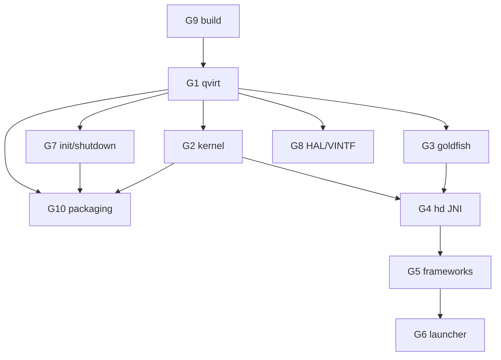

# Phase 1 — 融合最小 boot 集移植计划

> 状态：**G1 ✅ 完成（Phase 1，2026-07-17 boot 到 launcher）**。目标：把 M1 临时 boot 形态**转正**为结构化最小 BST 定制，并迁移到统一板 `device/bst/qvirt`。
> 权威 registry：[`patches/registry.json`](../patches/registry.json) v2 · schema [`registry.schema.md`](../patches/registry.schema.md)  
> Boot 证据：[`patches/android-16/RESTORE.md`](../patches/android-16/RESTORE.md) · [`progress/android-16-boot-guide.md`](android-16-boot-guide.md)

## 原则

- 工作单元 = **patch-group（G1–G10）**；关联项一起移植。
- **win 验证**（Layer1 每组强制；Layer2 在并入 boot 镜像时跑）；**mac 同码、不独立验证**。
- 每组：文档（源/用途/质量/影响）→ 埋点 → 验证回环 → **存 patch** → **checkpoint 可恢复**。
- `temp_debt=true` 本阶段**不强求根治**（登记挂 Phase 2），除非清单有对应真定制。

## 组依赖

建议实施序：~~G9（可并行）~~ → **G1** → G2/G3/G7/G8 → G4 → G5 → G6 → G10（打包回归）。

---

## G1 — 统一板 `device/bst/qvirt`（x86_64 + arm64） · **✅ 完成（Phase 1，2026-07-17）**

| 项 | 内容 |
|---|---|
| **状态** | ✅ Layer1 ✅ + Layer2 ✅（boot 到 launcher，host oracle 全绿，Root.vhd `2a7a497a`，porting-log cont.4） |
| 源 | mac `device/bst/qvirt`（`bst_arm64`）+ M1 `device/generic/common` + `device/generic/x86_64` |
| boot 映射 | `boot-device-generic-common` / `boot-device-generic-x86_64` / `list-device-bst-qvirt-mac` |
| 动作 | 把 generic overlay（init/ueventd/manifest/idc/bst_bins/nativebridge…）**并入 qvirt**；新增 `bst_x86_64` product；arch 差异下沉 BoardConfig |
| 用途 | lunch/product 主线；与 mac 同板 |
| 质量 | 真定制；迁移是 Phase1 **最大结构性**风险 |
| 影响 | 打破 M1 lunch 名；须 Layer2 gate |
| 验证 | Layer1 `lunch bst_x86_64-*-eng` + `m`；**Layer2 boot 回归 oracle 全绿** |
| checkpoint | [`patches/android-16/checkpoints/G1.md`](../patches/android-16/checkpoints/G1.md) + 更新 RESTORE |

### G1 进度清单

- [x] 脚手架：`device/bst/qvirt/{AndroidProducts.mk,BoardConfig.mk,bst_x86_64.mk}`（本地 + 远程）
- [x] `lunch bst_x86_64-trunk_staging-eng` 可用（`TARGET_PRODUCT=bst_x86_64`）
- [x] 埋点 `A16DBG:G1`（build-time warning）
- [x] Layer1：`m systemimage` + 产物 readback（**✅** rc=0，md5 `a5a67812…`，12:02）
- [x] 配置等价预检（`g1_equiv_check.sh` → EQUIVALENT）
- [x] HAL A16 编译修复 + 存档（`g1_hal_fixes.tar.gz`）
- [x] Stage system（`g1_stage_system.sh`，`ro.product.system.device=qvirt`）
- [x] 与 M1 generic 产物 diff（image md5 不同，预期；配置级等价已验证）
- [x] Stage system + Root.vhd 打包 + win 部署
- [x] Layer2 boot 回归 oracle — **✅ boot 到 launcher**（host oracle 全绿；修复链见 porting-log cont.1~cont.4 + G1.md）
- [x] 存 patch + registry `ported` + 更新 RESTORE（G1-RESTORE §1 Build 填实）

**G1 安全网序（降风险，P5）**：不要一步替换掉已 boot 的 generic。
1. 先在 qvirt 上**新增** `bst_x86_64` product/BoardConfig，与现有 `android_x86_64` **并存**（不删 generic）。
2. `lunch bst_x86_64` 构建 `system.img`，与 M1 generic 产物**diff 对比**（包列表/关键 lib md5），确认等价。
3. Layer2 用 `bst_x86_64` 产物跑 boot 回归，全绿后**才**下线 generic 路径。
4. 任一步不过 → 回退到 generic（M1 checkpoint），escalate。

## G2 — kernel-a16

| 项 | 内容 |
|---|---|
| 源 | `patches/android-16/kernel/` + 清单 win `kernel` / mac `kernel-mac` 最小子集 |
| 用途 | ext4 + squashfs + BS hooks；clang/LLVM=1 |
| 影响 | system.sfs 挂载、guest 驱动 |
| 验证 | Layer1 bzImage；Layer2 `A16DBG: system.sfs mounted` |
| checkpoint | kernel config + git.txt |

## G3 — goldfish-opengl-pie

| 项 | 内容 |
|---|---|
| 源 | `goldfish-opengl-pie.patch` + `device_generic_goldfish.patch` + aemu |
| 用途 | A16 GLES/HWC2、bstpgaipc、VsyncThread sp |
| 影响 | host 图形契约（Intel） |
| 验证 | bootanim + SF；无 host unhandled exception |
| checkpoint | goldfish patch + RESTORE |

## G4 — hd guest JNI + 通道

| 项 | 内容 |
|---|---|
| 源 | `hd-guest.patch` + `untracked-src/.../native`（hostcall/gcall） |
| 用途 | HCALL/GCALL；Player ready 门控链 |
| 影响 | host-guest 契约 |
| 验证 | `libhostcall_jni`/`libgcall_jni` 在；无 ULE |
| checkpoint | hd-guest + frameworks native bits |

## G5 — BST frameworks（**仅 boot-minimal 子集**）

| 项 | 内容 |
|---|---|
| 源 | `boot-frameworks-base` / `boot-frameworks-native` 存量（M1 diff）+ untracked `com.bluestacks.os.*` |
| 用途 | ActivityDisplayed、BstHostCall、FilterApps、SystemServer 跳过、锁屏 |
| **范围** | **只取 boot 必需子集**。`win-frameworks-base`(bst=220)/`mac-frameworks-base`(68)/`*-frameworks-native` 的**完整特性集属 Phase 2**（`P2-FRAMEWORK-REST`），勿在 G5 整包拉入 |
| 注意 | **不含** r262 TEMP（属 TEMP 组） |
| 机制 | fork-diff overlay，切 boot-minimal 子路径/hunk（见 patch-porting.md） |
| 验证 | `hcallOnActivityDisplayed` → `Player state: ready` |
| checkpoint | frameworks_base (+ native) boot 子集 |

## G6 — launcher

| 项 | 内容 |
|---|---|
| 源 | `aosp16__packages_apps_Launcher3.patch` + uncube 系统化 |
| 用途 | 去 HOME 抢占、widget NPE、uncube 获焦 |
| 验证 | uncube RESUMED + overlay 撤掉 |
| checkpoint | Launcher3 patch |

## G7 — init / system_core / 关机

| 项 | 内容 |
|---|---|
| 源 | `aosp16__system_core.patch`（关机 + installd early-start + init 路径） |
| 用途 | 优雅关机；PMS/installd 时序 |
| 质量 | **混合**：关机/installd = 真定制；SELinux/property/vdc bypass = `temp_debt` → TEMP |
| 验证 | 优雅关机 oracle；`start installd` 在 |
| checkpoint | system_core；文档标明哪些行是 debt |

## G8 — HAL / VINTF

| 项 | 内容 |
|---|---|
| 源 | hardware_interfaces / libhardware / `hardware/bst/audio` + manifest audio 条目 |
| 用途 | FactoryHal 找得到 audio；域正确 |
| 验证 | audioserver 无 SIGSEGV；HAL 域非 kernel |
| checkpoint | hardware patches + manifest fragments |

## G9 — build 适配

| 项 | 内容 |
|---|---|
| 源 | build_make / build_soong / art / boringssl / hwservicemanager / system_security |
| 用途 | 全树可编；kernel/VINTF/emulator 门禁 |
| 验证 | **仅 Layer1**（可不单独 Layer2） |
| checkpoint | 各 build_* patch |

## G10 — buildscripts / BootImage 打包

| 项 | 内容 |
|---|---|
| 源 | `app-player_buildscripts.patch` + `bootimage/hd/guest/*` |
| 用途 | Baklava Makefile、system.sfs、UUID、init.sh/stage2 |
| 影响 | 打包勿覆盖已打补丁 init.rc |
| 验证 | Root.vhd 部署 + **完整 Layer2 boot 回归**（Phase1 收口门闸） |
| checkpoint | buildscripts + bootimage 快照 + RESTORE 刷新 |

---

## 临时债（本阶段登记，Phase 2 收口）

| id | 说明 | Phase2 动作 |
|---|---|---|
| `boot-frameworks-base-r262-temp` | 关 Shell Transitions | 修 BLAST/SF commit → 删 TEMP patch |
| `temp-selinux-permissive-bypasses` | permissive + CheckMacPerms 等 | 提供 BST sepolicy；恢复 stock 路径 |
| `temp-keystore-data-wipe` | 运维 wipe | 留 RESTORE 运维节；非源码 port |
| G7 内嵌 bypass | coldboot/vdc/insecure-file… | 随 sepolicy/fstab 真实定制撤销 |

---

## 每组验证回环（强制清单）

1. registry 组内项 → `in-progress`
2. 研究填 `purpose`/`quality`/`impact`
3. rebase + `A16DBG:` 埋点
4. Layer1 remote build readback
5. （并入 boot 时）Layer2 oracle：M1 `RESTORE.md` §7 / `G1-RESTORE.md` §6
6. 存 patch + `checkpoint_ref` + `port_status=ported`
7. `/save-summary` + `/review`

**G1 与 G10 必须 Layer2 全绿**，否则 Phase1 不关门。

## 完成定义（Gate→P2）

- [ ] G1–G10 均 ported（或显式 blocked+escalate）
- [ ] temp_debt 项全部登记且挂 Phase2
- [ ] 最新 checkpoint 可按 RESTORE 流程恢复到可 boot 态
- [ ] win Layer2 回归证据写入 porting-log
